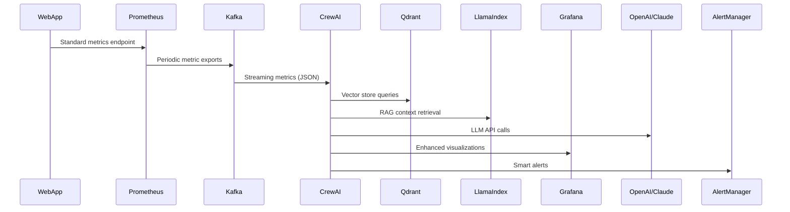

# AI-Enhanced Web Service Monitoring System Design Document

## 1. System Overview

### 1.1 Key Components
```plaintext
Web Apps → Prometheus → Kafka → CrewAI+LLM → Grafana + AlertManager
                                    ↑
                                    │
                                Qdrant + LlamaIndex
```

### 1.2 Key Features
- Real-time analysis with OpenAI/Claude APIs
- LlamaIndex-powered knowledge integration with Qdrant vector store
- Native Prometheus compatibility
- Kafka-based streaming pipeline
- Framework-agnostic instrumentation
- Multi-agent system for specialized monitoring tasks

## 2. Core Architecture

### 2.1 Data Flow


### 2.2 Component Matrix
| Component       | Technology Stack       | Educational Focus          |
|-----------------|------------------------|----------------------------|
| Metric Collector| Prometheus + Exporters | TSDB fundamentals          |
| Streaming Layer | Apache Kafka           | Distributed streaming      |
| AI Engine       | CrewAI + OpenAI/Claude | LLM integration            |
| Knowledge Base  | LlamaIndex + Qdrant    | RAG systems                |
| Visualization   | Grafana                | Observability dashboards   |

## 3. Implementation Details

### 3.1 Web Framework Integration

The `AIPrometheusExporter` class provides a generic way to instrument any web framework and expose metrics to Prometheus. Different frameworks require different integration approaches:

**Django**:
```python
from ai_monitoring import AIPrometheusExporter

class AIMonitoringMiddleware(AIPrometheusExporter):
    def process_request(self, request):
        self.start_request_timer(request)
        
    def process_response(self, request, response):
        self.end_request_timer(request, response)
        return response

# In settings.py
MIDDLEWARE = [
    # ...
    'myapp.middleware.AIMonitoringMiddleware',
]
```

**Flask**:
```python
from ai_monitoring import AIPrometheusExporter

class FlaskMonitoring(AIPrometheusExporter):
    def __init__(self, app=None):
        super().__init__()
        if app:
            self.init_app(app)
    
    def init_app(self, app):
        @app.before_request
        def start_timer():
            self.start_request_timer(request)
            
        @app.after_request
        def end_timer(response):
            self.end_request_timer(request, response)
            return response
```

**FastAPI**:
```python
from fastapi import FastAPI, Request, Response
from fastapi.middleware.base import BaseHTTPMiddleware
from ai_monitoring import AIPrometheusExporter

class AIMonitoringMiddleware(BaseHTTPMiddleware, AIPrometheusExporter):
    async def dispatch(self, request: Request, call_next):
        self.start_request_timer(request)
        response = await call_next(request)
        self.end_request_timer(request, response)
        return response

app = FastAPI()
app.add_middleware(AIMonitoringMiddleware)
```

### 3.2 Prometheus to Kafka Bridge

The improved Prometheus to Kafka bridge handles errors gracefully and includes retry logic:

```python
from prometheus_api_client import PrometheusConnect
from kafka import KafkaProducer
import json
import time
import logging
import backoff

class PrometheusToKafkaBridge:
    def __init__(self, prometheus_url, kafka_brokers, topic="prom_metrics",
                 polling_interval=60, batch_size=100):
        self.prometheus_url = prometheus_url
        self.kafka_brokers = kafka_brokers
        self.topic = topic
        self.polling_interval = polling_interval
        self.batch_size = batch_size
        self.prom = None
        self.producer = None
        
    def connect(self):
        """Establish connections to Prometheus and Kafka with retries"""
        try:
            self.prom = PrometheusConnect(url=self.prometheus_url, disable_ssl=True)
            self.producer = KafkaProducer(
                bootstrap_servers=self.kafka_brokers,
                value_serializer=lambda v: json.dumps(v).encode('utf-8'),
                retries=5,
                acks='all'
            )
            return True
        except Exception as e:
            logging.error(f"Connection error: {str(e)}")
            return False
    
    @backoff.on_exception(backoff.expo, Exception, max_tries=5)
    def query_prometheus(self, query='{__name__!=""}'):
        """Query Prometheus with exponential backoff retry"""
        return self.prom.custom_query(query)
    
    def run(self):
        """Main loop to poll Prometheus and send metrics to Kafka"""
        if not self.connect():
            logging.error("Failed to connect. Exiting.")
            return False
        
        logging.info("Starting Prometheus to Kafka bridge")
        while True:
            try:
                metrics = self.query_prometheus()
                
                # Split metrics into batches to avoid large messages
                for i in range(0, len(metrics), self.batch_size):
                    batch = metrics[i:i+self.batch_size]
                    self.producer.send(self.topic, batch)
                
                # Sleep until next polling interval
                time.sleep(self.polling_interval)
                
            except KeyboardInterrupt:
                logging.info("Received shutdown signal")
                self.producer.flush()
                self.producer.close()
                break
            except Exception as e:
                logging.error(f"Unexpected error: {str(e)}")
```

### 3.3 LlamaIndex with Qdrant Integration

Our updated system uses Qdrant for vector storage instead of MongoDB, providing superior vector similarity search for RAG applications:

```python
from llama_index import VectorStoreIndex, SimpleDirectoryReader
from llama_index.vector_stores import QdrantVectorStore
from llama_index.storage.storage_context import StorageContext
import qdrant_client

class QdrantKnowledgeBase:
    def __init__(self, 
                 collection_name="monitoring_knowledge",
                 qdrant_url="http://qdrant:6333",
                 qdrant_api_key=None,
                 embedding_dim=1536,  # Default for OpenAI's ada-002
                 knowledge_dir="./knowledge"):
        """Initialize Qdrant knowledge base"""
        self.collection_name = collection_name
        self.qdrant_url = qdrant_url
        self.qdrant_api_key = qdrant_api_key
        self.embedding_dim = embedding_dim
        self.knowledge_dir = knowledge_dir
        self.client = None
        self.index = None
        
        # Set up Qdrant client
        self._setup_qdrant_client()
        
    def _setup_qdrant_client(self):
        """Set up connection to Qdrant"""
        try:
            # Initialize Qdrant client
            if self.qdrant_api_key:
                self.client = qdrant_client.QdrantClient(
                    url=self.qdrant_url,
                    api_key=self.qdrant_api_key
                )
            else:
                self.client = qdrant_client.QdrantClient(url=self.qdrant_url)
                
            # Check if collection exists, create if it doesn't
            collections = self.client.get_collections().collections
            collection_names = [collection.name for collection in collections]
            
            if self.collection_name not in collection_names:
                self.client.create_collection(
                    collection_name=self.collection_name,
                    vectors_config={
                        "size": self.embedding_dim,
                        "distance": "Cosine"
                    }
                )
                print(f"Created new Qdrant collection: {self.collection_name}")
            else:
                print(f"Using existing Qdrant collection: {self.collection_name}")
                
            return True
        except Exception as e:
            print(f"Error setting up Qdrant client: {str(e)}")
            return False
    
    def build_index(self, force_rebuild=False):
        """Build or load the vector index"""
        try:
            # Get count of vectors in collection
            collection_info = self.client.get_collection(self.collection_name)
            vector_count = collection_info.vectors_count
            
            # If collection is empty or force_rebuild is True, build the index
            if vector_count == 0 or force_rebuild:
                # Load documents
                documents = SimpleDirectoryReader(self.knowledge_dir).load_data()
                
                # Create Qdrant vector store
                vector_store = QdrantVectorStore(
                    client=self.client, 
                    collection_name=self.collection_name
                )
                
                # Create storage context
                storage_context = StorageContext.from_defaults(vector_store=vector_store)
                
                # Build index
                self.index = VectorStoreIndex.from_documents(
                    documents,
                    storage_context=storage_context
                )
            else:
                # Create Qdrant vector store
                vector_store = QdrantVectorStore(
                    client=self.client, 
                    collection_name=self.collection_name
                )
                
                # Create storage context
                storage_context = StorageContext.from_defaults(vector_store=vector_store)
                
                # Load index
                self.index = VectorStoreIndex.from_vector_store(
                    vector_store=vector_store,
                    storage_context=storage_context
                )
                
            return self.index
        except Exception as e:
            print(f"Error building/loading index: {str(e)}")
            return None
    
    def query(self, query_text, top_k=5):
        """Query the knowledge base"""
        if not self.index:
            self.build_index()
            
        if not self.index:
            return "Error: Index not available"
            
        try:
            query_engine = self.index.as_query_engine(similarity_top_k=top_k)
            response = query_engine.query(query_text)
            return response
        except Exception as e:
            print(f"Error querying index: {str(e)}")
            return f"Error querying knowledge base: {str(e)}"
```

### 3.4 CrewAI Multi-Agent System

The monitoring system uses a team of specialized agents for different monitoring tasks:

```python
from crewai import Agent, Task, Crew, Process
from llama_index.tools import QueryEngineTool, ToolMetadata

class MonitoringAgentSystem:
    def __init__(self, 
                 openai_api_key=None, 
                 anthropic_api_key=None,
                 knowledge_base=None):
        """Initialize the monitoring agent system"""
        self.knowledge_base = knowledge_base
        self.set_api_keys(openai_api_key, anthropic_api_key)
        
    def create_agents(self):
        """Create all the required agents for the monitoring system"""
        # Create a query tool for the knowledge base
        kb_tool = QueryEngineTool(
            query_engine=self.knowledge_base.get_query_engine(),
            metadata=ToolMetadata(
                name="knowledge_base",
                description="Use this tool to search the knowledge base for information about system behavior, past incidents, and best practices."
            )
        )
        
        # Create Anomaly Detection Agent
        anomaly_detector = Agent(
            role="Anomaly Detection Specialist",
            goal="Identify anomalies in system metrics and determine their severity and impact",
            backstory="You're an expert at analyzing system metrics and detecting unusual patterns that indicate potential issues before they become critical failures.",
            verbose=True,
            allow_delegation=True,
            tools=[kb_tool]
        )
        
        # Create Root Cause Analysis Agent
        root_cause_analyzer = Agent(
            role="Root Cause Analyst",
            goal="Determine the underlying cause of detected anomalies",
            backstory="You're a specialized diagnostician who can trace system issues back to their source by analyzing patterns and correlations across multiple metrics and logs.",
            verbose=True,
            allow_delegation=True,
            tools=[kb_tool]
        )
        
        # Create Remediation Advisor Agent
        remediation_advisor = Agent(
            role="Remediation Advisor",
            goal="Provide actionable recommendations to address detected issues",
            backstory="You're a seasoned operations expert who knows the best practices for addressing system issues while minimizing impact on users and maintaining system stability.",
            verbose=True,
            allow_delegation=True,
            tools=[kb_tool]
        )
        
        # Create Communicator Agent
        communicator = Agent(
            role="Technical Communicator",
            goal="Synthesize findings and recommendations into clear, concise reports",
            backstory="You're skilled at translating complex technical information into clear, actionable insights that both technical and non-technical stakeholders can understand.",
            verbose=True,
            allow_delegation=False,
            tools=[kb_tool]
        )
        
        return {
            "anomaly_detector": anomaly_detector,
            "root_cause_analyzer": root_cause_analyzer,
            "remediation_advisor": remediation_advisor,
            "communicator": communicator
        }
    
    def analyze_metrics(self, metrics_data):
        """Analyze metrics and return insights"""
        # Create agents
        agents = self.create_agents()
        
        # Define tasks
        detect_task = Task(
            description=f"Analyze the metrics and identify any anomalies or unusual patterns.",
            agent=agents["anomaly_detector"]
        )
        
        analyze_task = Task(
            description="Based on the anomalies identified, determine the most likely root causes.",
            agent=agents["root_cause_analyzer"],
            context=[detect_task]
        )
        
        remediate_task = Task(
            description="Develop a detailed remediation plan for the identified issues.",
            agent=agents["remediation_advisor"],
            context=[detect_task, analyze_task]
        )
        
        report_task = Task(
            description="Create a comprehensive incident report that summarizes the anomalies, root causes, and recommendations.",
            agent=agents["communicator"],
            context=[detect_task, analyze_task, remediate_task]
        )
        
        # Create crew
        crew = Crew(
            agents=list(agents.values()),
            tasks=[detect_task, analyze_task, remediate_task, report_task],
            verbose=2,
            process=Process.sequential
        )
        
        # Execute tasks
        result = crew.kickoff()
        
        return result
```

### 3.5 API Endpoints

The system exposes several API endpoints for monitoring and analysis:

```python
from fastapi import FastAPI, HTTPException, Depends, BackgroundTasks
from fastapi.middleware.cors import CORSMiddleware
from pydantic import BaseModel, Field
from typing import List, Dict, Any, Optional
from datetime import datetime
import httpx
import os
from qdrant_client import QdrantClient

app = FastAPI(title="AI Monitoring System API")

# Add CORS middleware
app.add_middleware(
    CORSMiddleware,
    allow_origins=["*"],
    allow_credentials=True,
    allow_methods=["*"],
    allow_headers=["*"],
)

@app.post("/metrics", status_code=201)
async def ingest_metrics(metrics: MetricBatch, background_tasks: BackgroundTasks):
    """Ingest metrics from Prometheus"""
    # Store metrics in memory for immediate processing
    # In a real implementation, you might want to push these to Kafka
    
    # Check for potential anomalies in background
    background_tasks.add_task(check_for_anomalies, metrics.metrics)
    
    return {"status": "success", "message": f"Ingested {len(metrics.metrics)} metrics"}

@app.post("/analyze", response_model=AnomalyResponse)
async def analyze_metrics(request: AnomalyRequest):
    """Analyze metrics for anomalies"""
    try:
        async with httpx.AsyncClient() as client:
            response = await client.post(
                f"{AI_AGENTS_URL}/analyze",
                json=request.dict(),
                timeout=60  # LLM calls might take time
            )
            if response.status_code != 200:
                raise HTTPException(
                    status_code=response.status_code,
                    detail=f"Error from AI agents: {response.text}"
                )
            return response.json()
    except httpx.TimeoutException:
        raise HTTPException(status_code=504, detail="Analysis timed out")
    except Exception as e:
        raise HTTPException(status_code=500, detail=f"Analysis error: {str(e)}")

@app.post("/query", response_model=QueryResponse)
async def query_knowledge_base(request: QueryRequest):
    """Query the knowledge base"""
    try:
        async with httpx.AsyncClient() as client:
            response = await client.post(
                f"{AI_AGENTS_URL}/query",
                json=request.dict(),
                timeout=30
            )
            if response.status_code != 200:
                raise HTTPException(
                    status_code=response.status_code,
                    detail=f"Error from AI agents: {response.text}"
                )
            return response.json()
    except Exception as e:
        raise HTTPException(status_code=500, detail=f"Query error: {str(e)}")

@app.post("/refresh-knowledge")
async def refresh_knowledge_base():
    """Force a refresh of the knowledge base"""
    try:
        async with httpx.AsyncClient() as client:
            response = await client.post(f"{AI_AGENTS_URL}/refresh-knowledge")
            if response.status_code != 200:
                raise HTTPException(
                    status_code=response.status_code,
                    detail=f"Error refreshing knowledge base: {response.text}"
                )
            return {"status": "success", "message": "Knowledge base refreshed"}
    except Exception as e:
        raise HTTPException(
            status_code=500, 
            detail=f"Error refreshing knowledge base: {str(e)}"
        )
```


## 4. Project Directory Structure

```
ai-monitoring/
├── .env                           # Environment variables
├── docker-compose.yml            # Docker Compose configuration
├── README.md                     # Project documentation
│
├── app/                          # Main application code
│   ├── __init__.py
│   ├── prom_exporter.py          # Prometheus metrics exporter
│   ├── prometheus_to_kafka.py    # Prometheus to Kafka bridge
│   ├── api/                      # FastAPI application
│   │   ├── __init__.py
│   │   ├── main.py               # API routes
│   │   ├── models.py             # Data models
│   │   └── utils.py              # Utility functions
│   │
│   ├── web_app.py                # Example web application
│   └── Dockerfile.api            # Dockerfile for API service
│
├── ai-agents/                    # AI agent code
│   ├── __init__.py
│   ├── agent_system.py           # MonitoringAgentSystem implementation
│   ├── agents/                   # Individual agent implementations
│   │   ├── __init__.py
│   │   ├── anomaly_detector.py   # Anomaly detection agent
│   │   ├── root_cause_analyzer.py # Root cause analysis agent
│   │   ├── remediation_advisor.py # Remediation advisor agent
│   │   └── communicator.py       # Report generation agent
│   │
│   ├── llamaindex_qdrant.py      # Qdrant knowledge base integration
│   ├── main.py                   # Agent service entry point
│   └── Dockerfile                # Dockerfile for agent service
│
├── knowledge/                    # Knowledge base sources
│   ├── logs/                     # Application logs
│   │   └── example_logs.txt
│   ├── best_practices/           # Best practices documentation
│   │   ├── performance_tuning.md
│   │   └── troubleshooting.md
│   └── incidents/                # Incident reports
│       ├── incident_2023_01_15.md
│       └── postmortem_template.md
│
├── prometheus/                   # Prometheus configuration
│   ├── prometheus.yml            # Main configuration
│   └── alerts.yml                # Alert rules
│
└── grafana/                      # Grafana configuration
    └── provisioning/             # Provisioning configuration
        ├── dashboards/           # Dashboard definitions
        │   ├── ai_monitoring.json
        │   └── system_overview.json
        └── datasources/          # Data source configuration
            └── prometheus.yml
```

