# Session 1: Foundations of Multi-Agent AI Monitoring

## Introduction to Multi-Agent Systems (30 min)

### What are Multi-Agent Systems?
- Collections of autonomous agents that interact with each other and their environment
- Each agent has specialized capabilities and knowledge
- Agents collaborate to solve complex problems
- Advantages: specialization, parallelism, robustness, scalability


Think of a multi-agent system like a team of specialists working together. Just like how a hospital has doctors, nurses, and technicians with different skills all working together to help patients, a multi-agent AI system has different AI "workers" that each do specific jobs and share information to solve big problems.

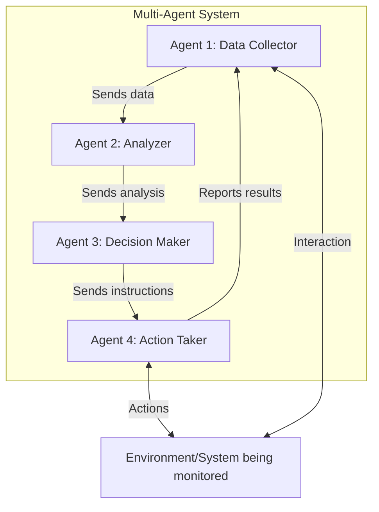

**Why Use Multiple Agents Instead of One Big AI?**
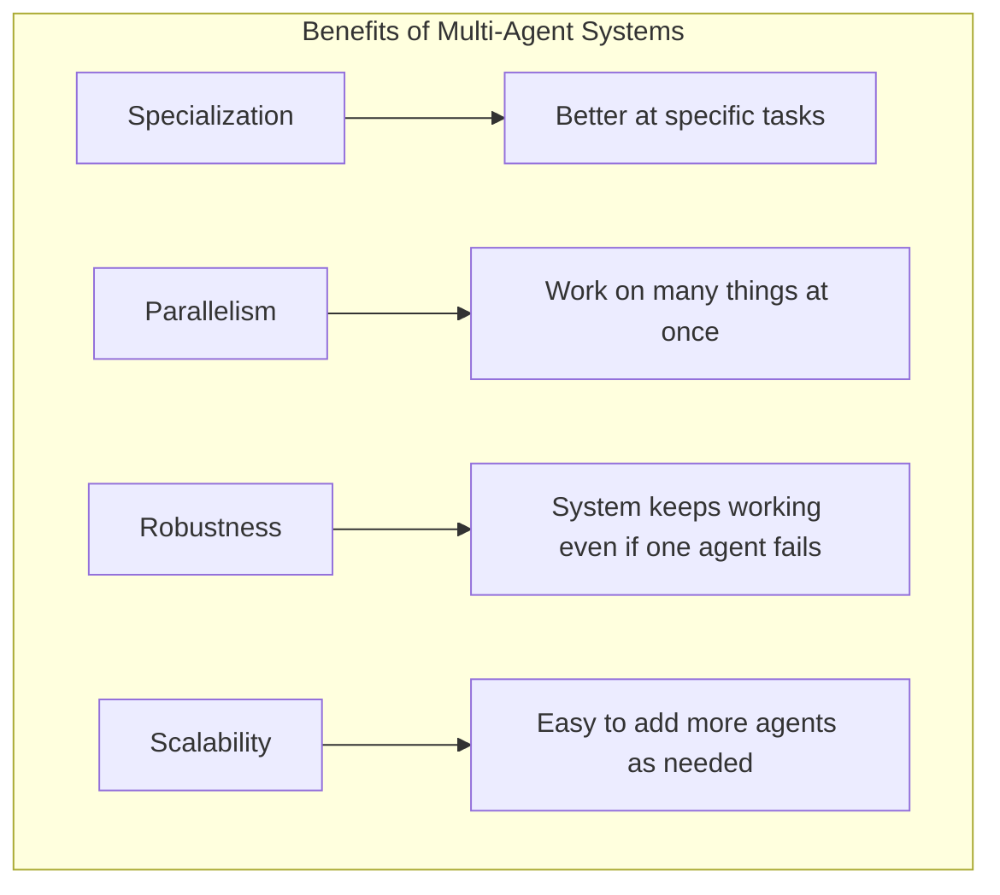

### Core Architectures

**Centralized Architecture:**
One main agent gives orders to all other agents, like a boss managing workers.

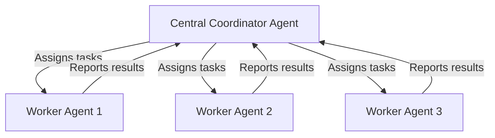

**Decentralized Architecture:**
All agents work independently and talk directly to each other, like colleagues collaborating without a boss.

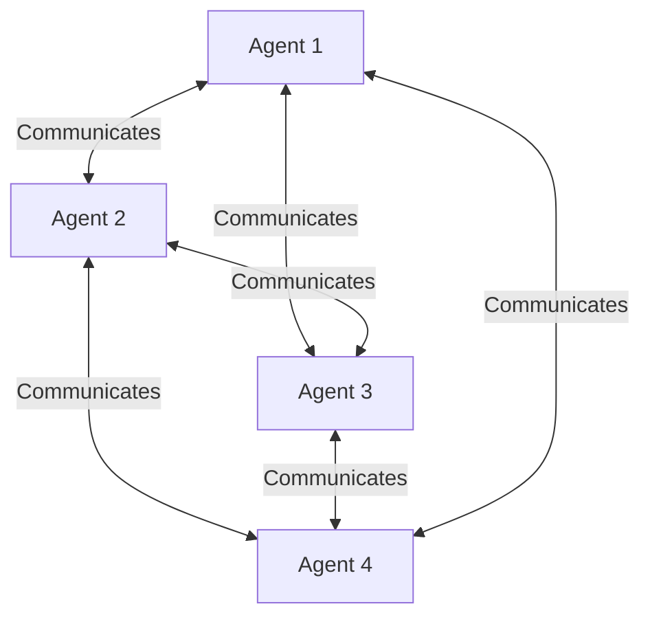

**Hierarchical Architecture:**
Agents are organized in levels, like a company with executives, managers, and employees.

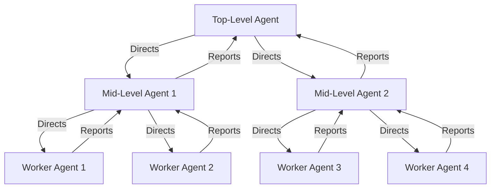

**Hybrid Architecture:**
A mix of different approaches, like a company that has both managers and self-organizing teams.

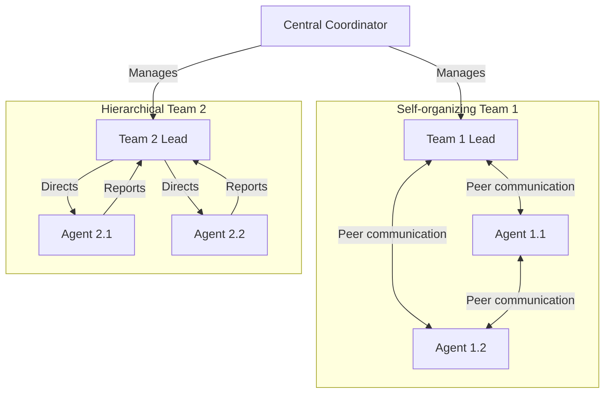

### Agent Communication and Coordination

**In Simple Words:**
Agents need ways to talk to each other and work together without getting in each other's way. This is like how people use language, shared documents, delegation, and conflict resolution in a workplace.

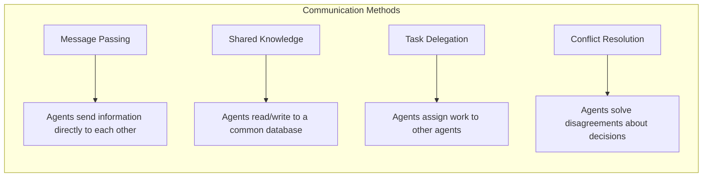

**Example of Message Passing:**
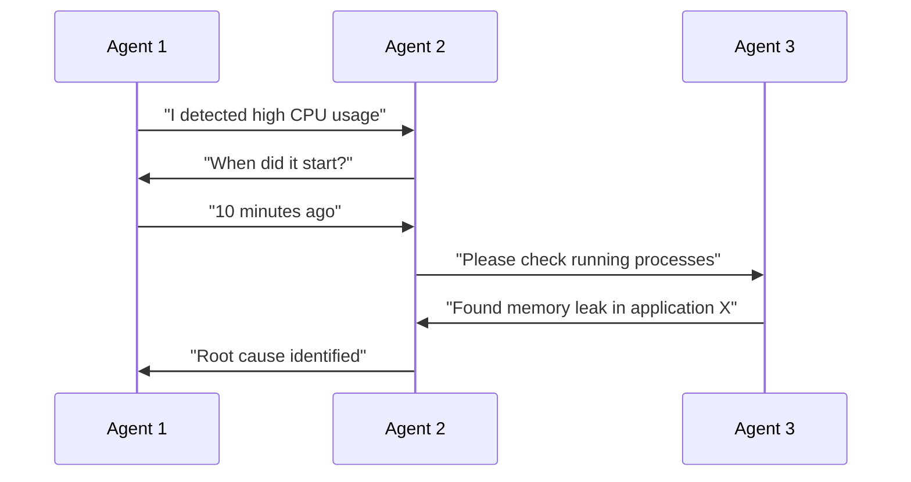

### CrewAI Framework Overview

**In Simple Words:**
CrewAI is like a toolkit for building teams of AI agents. It gives you all the pieces you need to create specialized AI workers, assign them tasks, organize them into crews, and give them tools to use.

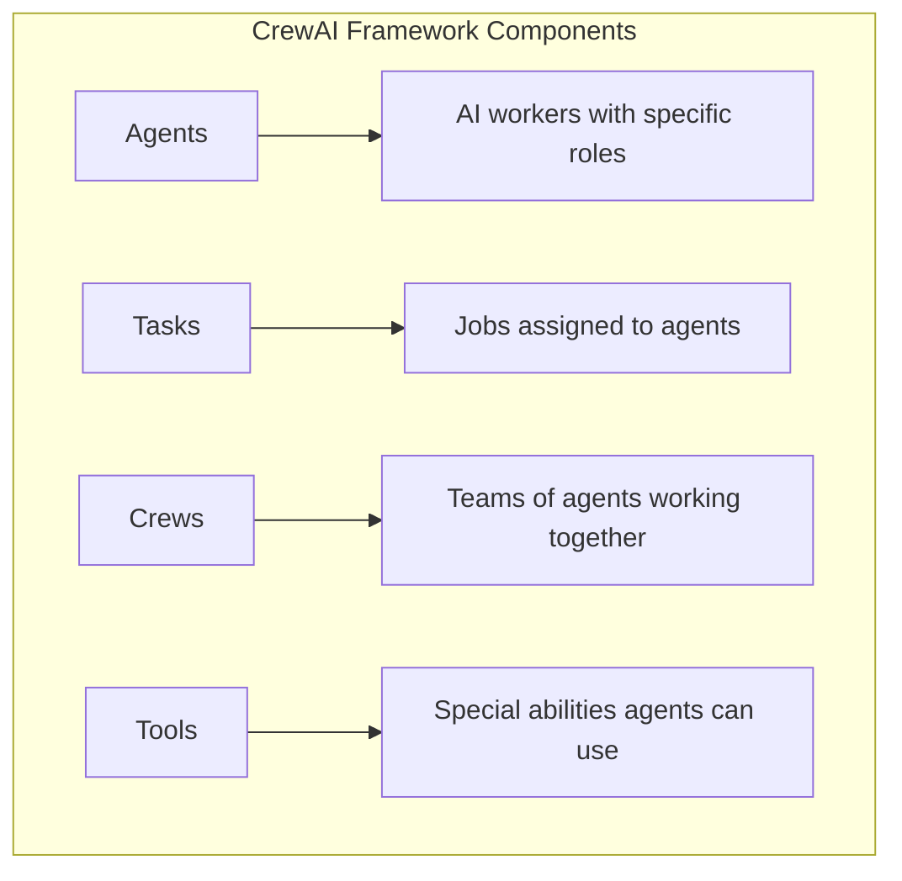

**How CrewAI Organizes Work:**
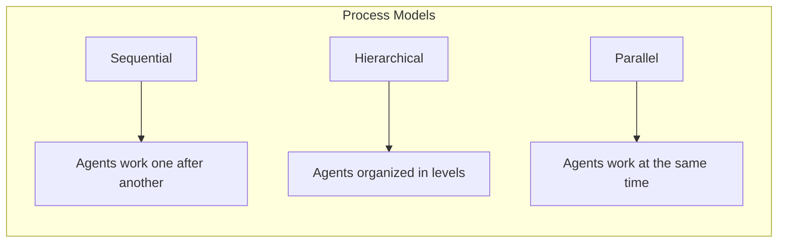

## Setting Up the Development Environment (30 min)

### Required Tools

**In Simple Words:**
Before we can build our AI agent system, we need to install some basic tools:
- Python 3.12: The programming language we'll use
- Docker: A way to package our application so it runs the same everywhere
- Git: Keeps track of changes to our code
- IDE (VS Code): A program that makes writing code easier

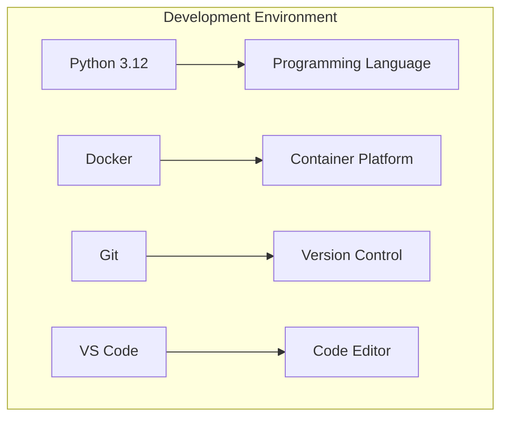

### Python Environment Setup
```bash
# Create a virtual environment
python -m venv venv

# Activate the environment
# On Windows:
venv\Scripts\activate
# On macOS/Linux:
source venv/bin/activate

# Install dependencies
pip install -r requirements.txt
```

**In Simple Words:**
These commands:
1. Create a special folder (virtual environment) for our project's tools
2. Turn on this special environment
3. Install all the tools our project needs

### Key Dependencies

**In Simple Words:**
Our project uses several important tools:
- CrewAI: Helps us build teams of AI agents
- LlamaIndex: Helps our agents find and use information
- Qdrant: Stores information in a way that's easy for AI to search
- FastAPI: Lets us create web services
- Prometheus Client: Collects measurements about how our system is working
- Kafka-Python: Helps move data quickly between different parts of our system

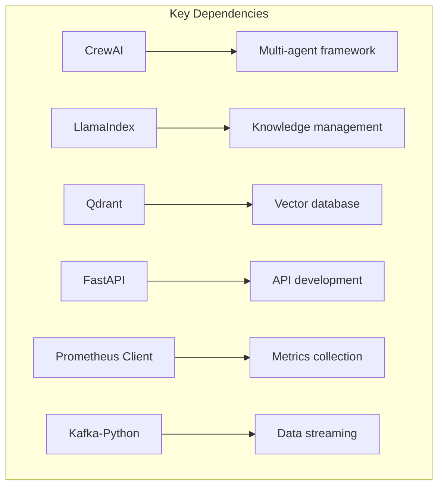

### Docker Environment

**In Simple Words:**
Docker helps us package all the parts of our system so they work together smoothly. It's like having separate containers for each part of our application that can all talk to each other.

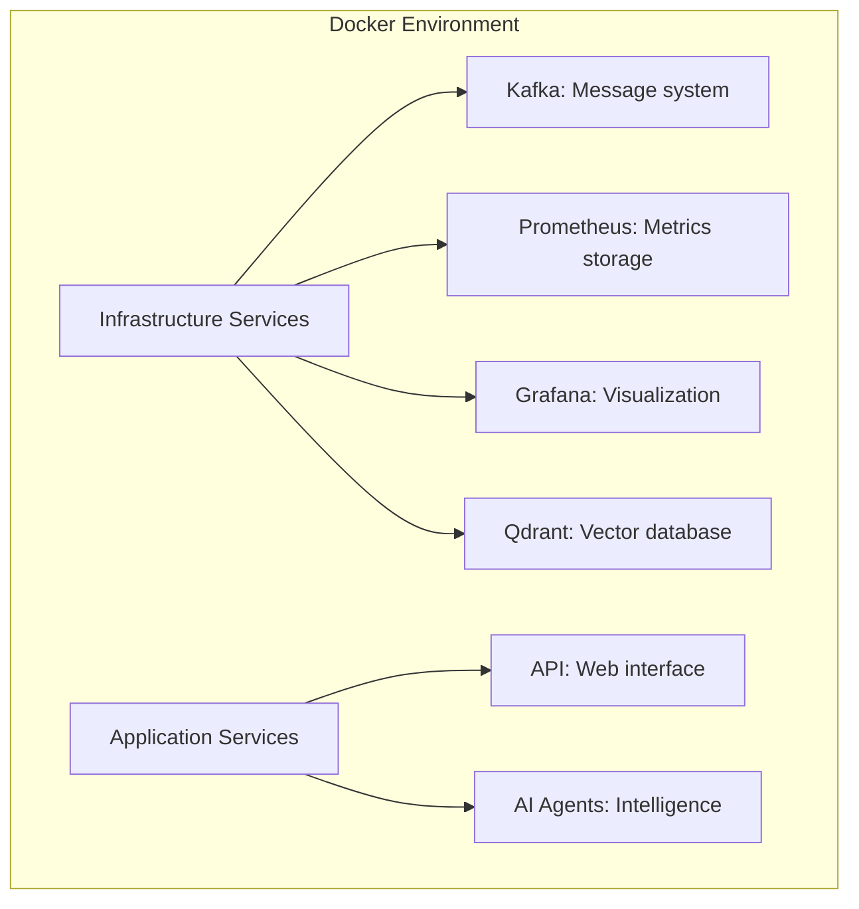

## Hands-on: Building Your First AI Agent (1 hour)

### Creating a Simple Monitoring Agent

```python
from crewai import Agent

# Create a basic monitoring agent
monitoring_agent = Agent(
    role="System Monitor",
    goal="Monitor system metrics and detect anomalies",
    backstory="You're an expert at analyzing system metrics and detecting unusual patterns that indicate potential issues.",
    verbose=True
)
```

**In Simple Words:**
This code creates an AI agent whose job is to watch system measurements and find anything unusual. We give the agent:
- A role: System Monitor (what job it does)
- A goal: Find unusual patterns in measurements
- A backstory: It's an expert at analyzing measurements
- verbose=True: This tells the agent to share details about what it's doing

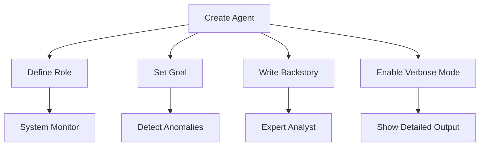

### Implementing Basic Agent Behaviors

```python
from crewai import Task

# Define a monitoring task
monitoring_task = Task(
    description="Analyze the following metrics and identify any anomalies.",
    agent=monitoring_agent,
    expected_output="A detailed description of any anomalies found, including the specific metrics affected."
)
```

**In Simple Words:**
This code creates a specific job for our monitoring agent. We:
- Describe what the agent needs to do
- Assign the task to our monitoring agent
- Specify what kind of results we expect to get back

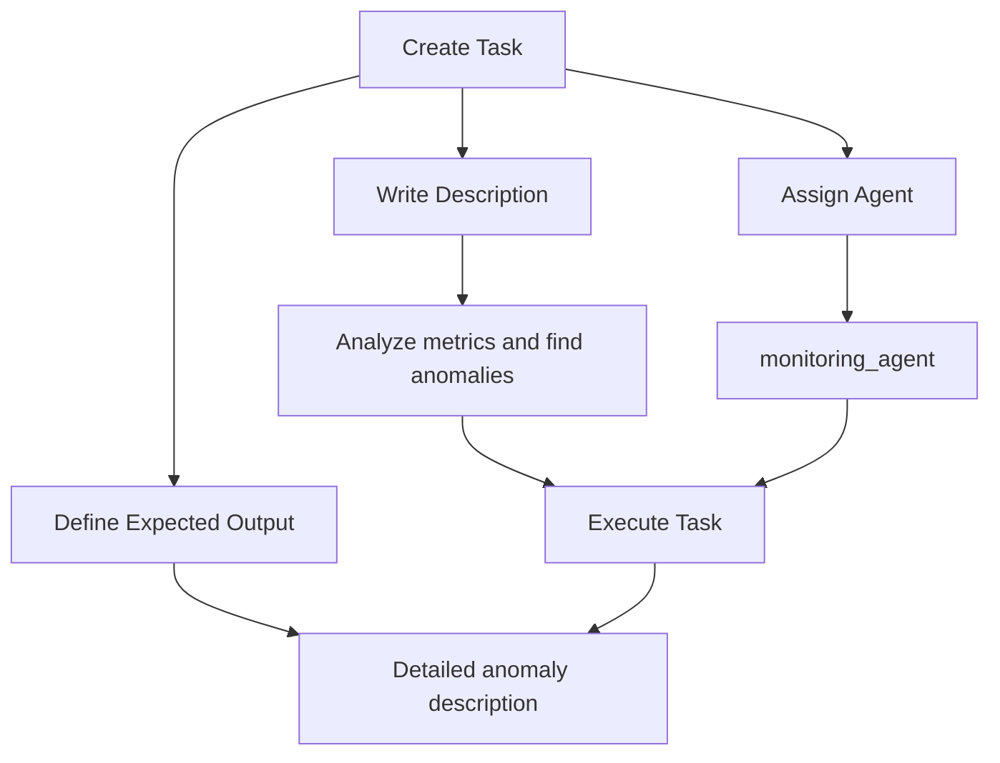

### Testing and Debugging

**In Simple Words:**
After creating our agent, we need to test it to make sure it works correctly:
- Run the agent on our computer
- Give it some test measurements to analyze
- Check what the agent tells us
- Fix any problems we find

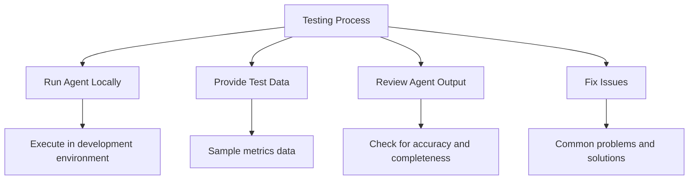

### Exercise: Extend the Basic Agent

**In Simple Words:**
Now it's your turn to improve the agent:
1. Add special tools the agent can use (like checking logs or sending alerts)
2. Teach the agent to find a specific type of problem (like memory leaks)
3. Test your improved agent with example data

```mermaid
flowchart TD
    A[Extend Agent] --> B[Add Custom Tools]
    A --> C[Implement Detection Capability]
    A --> D[Test with Sample Data]
    
    B --> B1[Log analyzer tool]
    B --> B2[Alert notification tool]
    
    C --> C1[Memory leak detection]
    C --> C2[CPU spike detection]
    
    D --> D1[Run with test metrics]
    D --> D2[Evaluate results]
