# Session 2: Core Components

## Distributed Monitoring Architecture (30 min)

### Introduction to Prometheus
- Time-series database for metrics collection
- Pull-based architecture
- Key components:
  - Scrapers: Collect metrics from endpoints
  - Storage: Time-series database
  - PromQL: Query language
  - Alertmanager: Handles alerts

**In Simple Words:**
Think of Prometheus like a health monitor for your computer systems. Just as a doctor regularly checks your vital signs (heart rate, blood pressure, etc.), Prometheus regularly checks your system's vital signs (CPU usage, memory, response times). Instead of waiting for you to send health updates, it actively goes out and collects this information on a schedule, stores it in a special database, and can alert you when something doesn't look right.

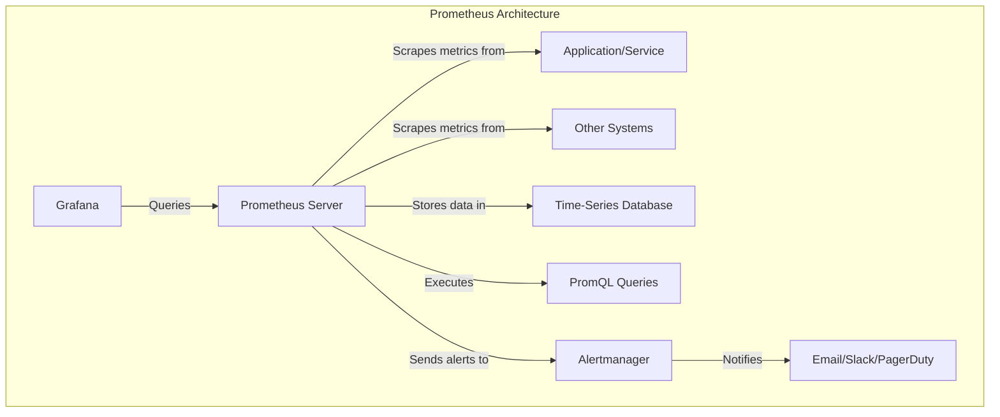

### Prometheus Metrics Types
- **Counter**: Cumulative metric that only increases (e.g., request count)
- **Gauge**: Metric that can go up and down (e.g., memory usage)
- **Histogram**: Samples observations and counts them in configurable buckets
- **Summary**: Similar to histogram, but calculates quantiles over a sliding time window

**In Simple Words:**
Prometheus uses different types of measurements, like different instruments in a doctor's office:

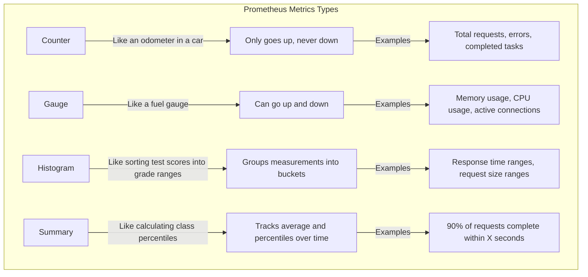

### Kafka Streaming Basics
- Distributed event streaming platform
- Key components:
  - Topics: Categories for message streams
  - Producers: Send messages to topics
  - Consumers: Read messages from topics
  - Brokers: Kafka server instances
  - Consumer Groups: Load balancing across consumers

**In Simple Words:**
Kafka works like a super-efficient postal service for computer data. Imagine a post office with different mailboxes (topics) for different types of mail. Some people (producers) drop off mail into these mailboxes. The post office (brokers) organizes and stores this mail. Other people (consumers) come to collect mail from specific mailboxes they're interested in. Multiple people can read the same mail without removing it, and groups of people (consumer groups) can divide up the work of processing mail from a single mailbox.

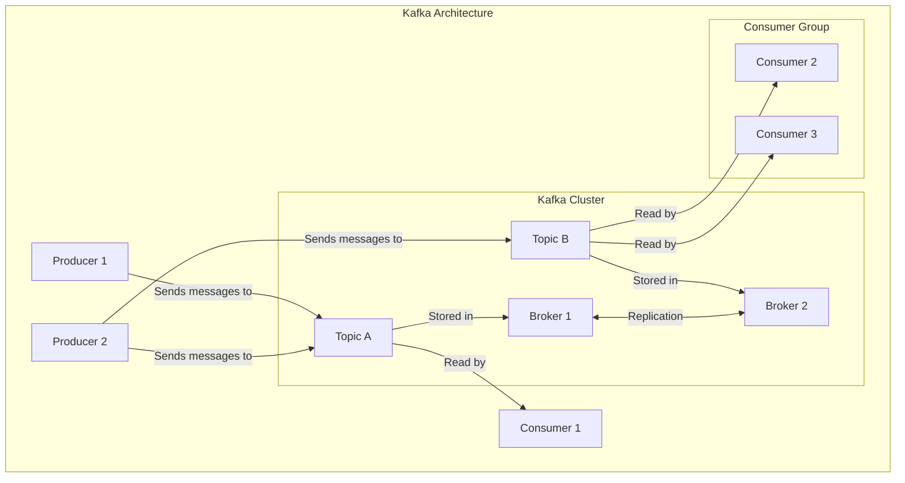

### System Metrics Collection
- Framework-agnostic instrumentation
- Middleware integration
- Custom metrics creation
- Exporters for different services

**In Simple Words:**
Collecting metrics from your system is like installing various sensors throughout your house to monitor temperature, electricity usage, water flow, and security. These sensors can be added to any part of your house (your application) regardless of how it was built. Some sensors come built-in with appliances (middleware integration), some you install yourself (custom metrics), and some are special adapters that let older appliances connect to your monitoring system (exporters).

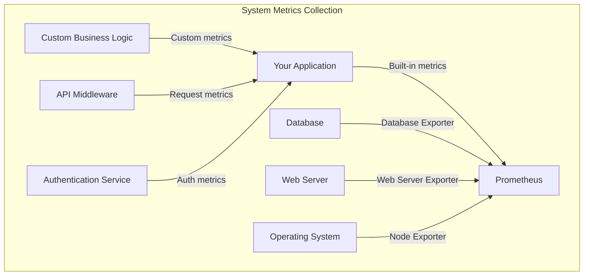

### Prometheus to Kafka Bridge
```python
class PrometheusToKafkaBridge:
    def __init__(self, prometheus_url, kafka_brokers, topic="prom_metrics",
                 polling_interval=60, batch_size=100):
        self.prometheus_url = prometheus_url
        self.kafka_brokers = kafka_brokers
        self.topic = topic
        self.polling_interval = polling_interval
        self.batch_size = batch_size
        self.prom = None
        self.producer = None
        
    def connect(self):
        """Establish connections to Prometheus and Kafka with retries"""
        try:
            self.prom = PrometheusConnect(url=self.prometheus_url, disable_ssl=True)
            self.producer = KafkaProducer(
                bootstrap_servers=self.kafka_brokers,
                value_serializer=lambda v: json.dumps(v).encode('utf-8'),
                retries=5,
                acks='all'
            )
            return True
        except Exception as e:
            logging.error(f"Connection error: {str(e)}")
            return False
```

**In Simple Words:**
This code creates a bridge that connects Prometheus (our health monitoring system) to Kafka (our mail delivery system). It's like having a person who regularly checks all the health sensors in your house and then sends reports through the mail to other people who need to know about the health of your house. The bridge:
- Knows where to find Prometheus and Kafka
- Decides how often to check for new metrics (polling_interval)
- Determines how many metrics to send at once (batch_size)
- Has methods to connect to both systems

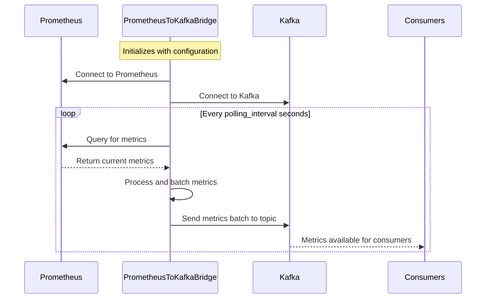

## Knowledge Management with LlamaIndex (45 min)

### Understanding Vector Databases
- Purpose: Efficient similarity search for embeddings
- How they work: Index vectors for fast nearest-neighbor search
- Comparison to traditional databases
- Popular options: Qdrant, Pinecone, Weaviate, Milvus

**In Simple Words:**
Imagine a library where books are organized not by author or title, but by how similar their content is. Books about similar topics would be placed near each other on the shelves. A vector database works the same way for AI - it converts text, images, or other data into special "coordinates" (vectors) and organizes them so that similar items are "near" each other. This makes it very fast to find information that's similar to what you're looking for, even if it doesn't contain the exact words you searched for.

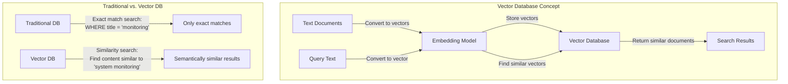

### Document Ingestion and Indexing
- Document loading and chunking
- Text embedding generation
- Vector storage and indexing
- Metadata management

**In Simple Words:**
Getting documents into a vector database is like preparing books for a library:
1. First, you break large books into chapters or sections (chunking)
2. Then, you create a special "essence" of each section that captures its meaning (embedding)
3. Next, you organize these essences in a way that makes them easy to find (indexing)
4. Finally, you keep track of information about each section, like which book it came from (metadata)

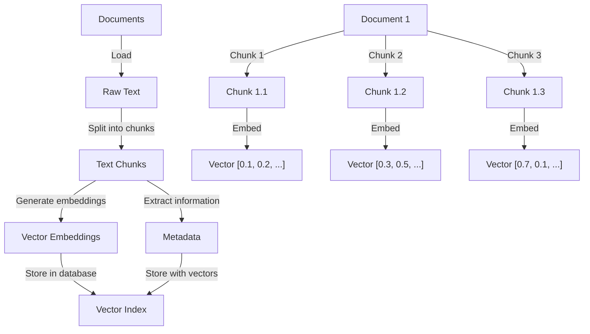

### Qdrant Vector Store
- High-performance vector similarity search
- Filtering capabilities
- Scalable architecture
- Python client integration

**In Simple Words:**
Qdrant is like a specialized library with super-fast librarians who can instantly find books similar to the one you're interested in. It not only organizes books by similarity but also lets you filter by other properties - like "only show me science fiction books published after 2010 that are similar to this book." It's designed to handle millions of books efficiently and works well with Python, making it easy for our code to use.

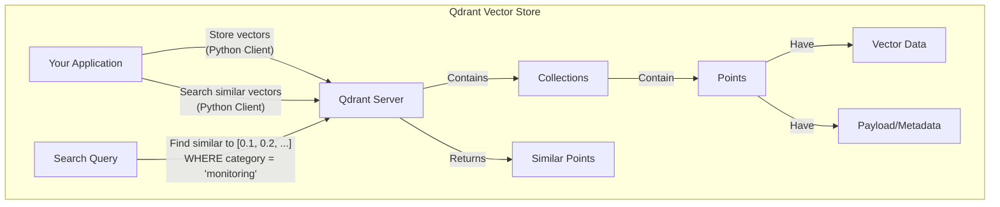

### LlamaIndex Integration
```python
class QdrantKnowledgeBase:
    def __init__(self, 
                 collection_name="monitoring_knowledge",
                 qdrant_url="http://qdrant:6333",
                 qdrant_api_key=None,
                 embedding_dim=1536,
                 knowledge_dir="./knowledge"):
        self.collection_name = collection_name
        self.qdrant_url = qdrant_url
        self.qdrant_api_key = qdrant_api_key
        self.embedding_dim = embedding_dim
        self.knowledge_dir = knowledge_dir
        self.client = None
        self.index = None
        
        # Set up Qdrant client
        self._setup_qdrant_client()
```

**In Simple Words:**
This code creates a special knowledge base using Qdrant (our similarity library) and LlamaIndex (a tool that helps manage knowledge for AI). It's like setting up a specialized research assistant who has access to a library of information about monitoring systems. The knowledge base:
- Has a name for its collection of information
- Knows where to find the Qdrant server
- Has security credentials if needed
- Knows how detailed the "essence" of each document should be (embedding_dim)
- Knows where to find the documents to learn from (knowledge_dir)

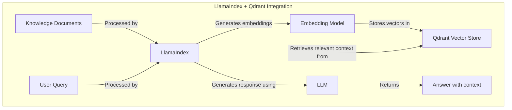

### Query Processing
- Query embedding generation
- Vector similarity search
- Result ranking and filtering
- Response generation

**In Simple Words:**
When you ask a question, the system follows these steps:
1. Converts your question into the same kind of "essence" (vector) as the stored documents
2. Finds documents with similar "essences" to your question
3. Sorts these documents by how relevant they are to your question
4. Uses the most relevant documents to help generate a helpful answer

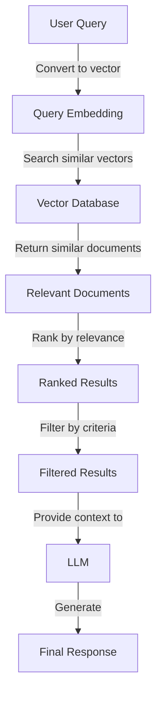

## Hands-on: Building the Monitoring Pipeline (45 min)

### Setting up Prometheus Exporters
- Creating a custom exporter class
- Implementing metric collection
- Exposing metrics endpoint
- Configuring Prometheus to scrape metrics

**In Simple Words:**
Setting up Prometheus exporters is like installing sensors in your house:
1. First, you create a special device (exporter class) that knows how to measure things
2. Then, you program it to collect specific measurements (metric collection)
3. Next, you make sure it has a way to share these measurements when asked (metrics endpoint)
4. Finally, you tell your monitoring system where to find these sensors (Prometheus configuration)

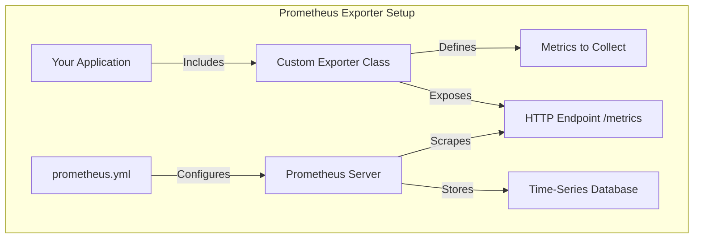

### Implementing Kafka Producers/Consumers
- Setting up Kafka producer for metrics
- Implementing batch processing
- Error handling and retries
- Monitoring Kafka performance

**In Simple Words:**
Setting up Kafka producers and consumers is like creating a reliable mail delivery system:
1. The producer is like a person who collects and sends letters (metrics)
2. Batch processing is like bundling multiple letters into one package for efficiency
3. Error handling and retries ensure that if a letter can't be delivered, it will be tried again
4. Monitoring the system itself helps ensure the mail service stays reliable

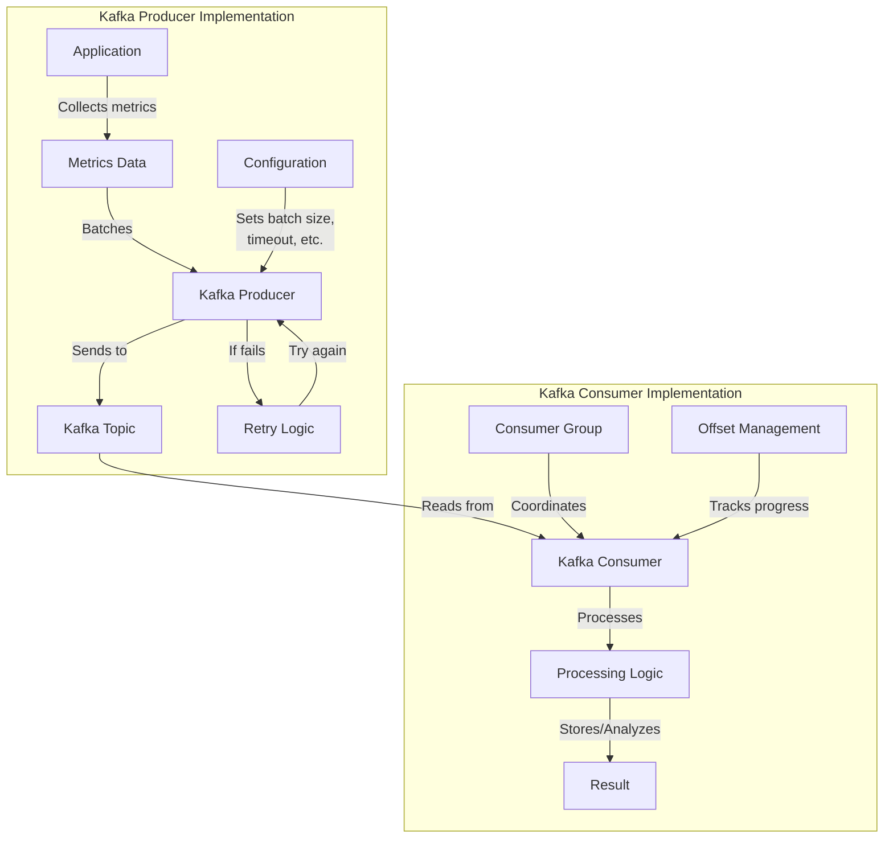

### Creating the Knowledge Base
- Organizing knowledge documents
- Building the vector index
- Testing query capabilities
- Optimizing retrieval performance

**In Simple Words:**
Creating a knowledge base is like building a specialized library:
1. First, you collect and organize important documents about your system
2. Then, you create a special index that helps find information quickly
3. Next, you test the library by asking questions and seeing if it finds good answers
4. Finally, you fine-tune the system to make it faster and more accurate

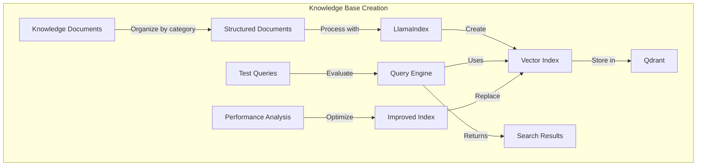

### Exercise: Complete Pipeline Integration
- Connect Prometheus exporter to application
- Stream metrics to Kafka
- Process metrics with consumer
- Query knowledge base for context

**In Simple Words:**
In this exercise, you'll connect all the pieces to create a complete monitoring system:
1. Add sensors (Prometheus exporters) to your application to collect measurements
2. Send these measurements through a delivery system (Kafka) for processing
3. Have workers (consumers) process and analyze these measurements
4. Use a smart library (knowledge base) to provide context and help understand the measurements

```mermaid
flowchart LR
    subgraph "Complete Monitoring Pipeline"
        A[Your Application] -->|"Exposes metrics"| B[Prometheus Exporter]
        B -->|"Scraped by"| C[Prometheus]
        C -->|"Metrics sent to"| D[Kafka Bridge]
        D -->|"Publishes to"| E[Kafka Topic]
        E -->|"Consumed by"| F[Metrics Consumer]
        F -->|"Analyzes with"| G[AI Agents]
        G -->|"Queries"| H[Knowledge Base]
        H -->|"Provides context"| G
        G -->|"Generates"| I[Insights & Alerts]
    end
