# Session 3: Integration and Intelligence

## AI Agent Implementation (45 min)

### Anomaly Detection Agent
- Role: Identify unusual patterns in metrics
- Capabilities:
  - Statistical anomaly detection
  - Pattern recognition
  - Severity assessment
  - Impact analysis
- Implementation:

```python
anomaly_detector = Agent(
    role="Anomaly Detection Specialist",
    goal="Identify anomalies in system metrics and determine their severity and impact",
    backstory="You're an expert at analyzing system metrics and detecting unusual patterns that indicate potential issues before they become critical failures.",
    verbose=True,
    allow_delegation=True,
    tools=[kb_tool]
)
```

**In Simple Words:**
The Anomaly Detection Agent is like a doctor who specializes in spotting unusual symptoms. Just as a doctor examines your vital signs and notices when something is abnormal, this agent examines your system's measurements and notices when something doesn't look right. It can tell the difference between normal variations and concerning patterns, determine how serious a problem is, and figure out which parts of your system might be affected.

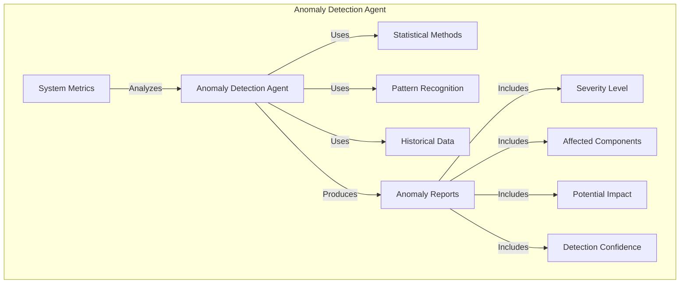

**How the Anomaly Detection Agent Works:**
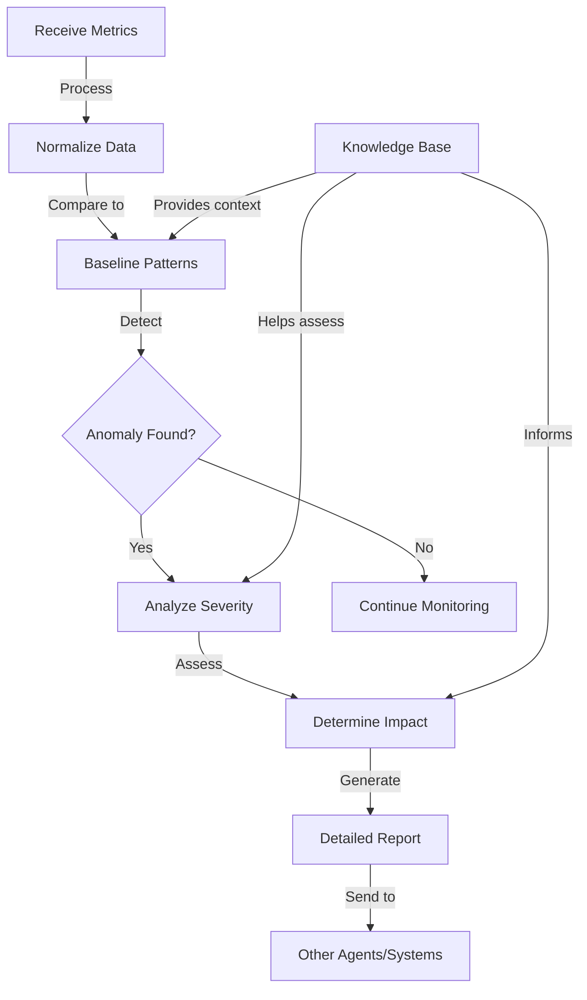

### Remediation Advisor Agent
- Role: Provide actionable recommendations
- Capabilities:
  - Root cause analysis
  - Solution recommendation
  - Best practice application
  - Knowledge base integration
- Implementation:

```python
remediation_advisor = Agent(
    role="Remediation Advisor",
    goal="Provide actionable recommendations to address detected issues",
    backstory="You're a seasoned operations expert who knows the best practices for addressing system issues while minimizing impact on users and maintaining system stability.",
    verbose=True,
    allow_delegation=True,
    tools=[kb_tool]
)
```

**In Simple Words:**
The Remediation Advisor Agent is like a repair specialist who knows how to fix problems. After the Anomaly Detection Agent (the doctor) identifies an issue, the Remediation Advisor (the repair specialist) figures out what's causing the problem and recommends the best way to fix it. This agent uses its knowledge of best practices and past solutions to suggest actions that will solve the problem while causing minimal disruption to users.

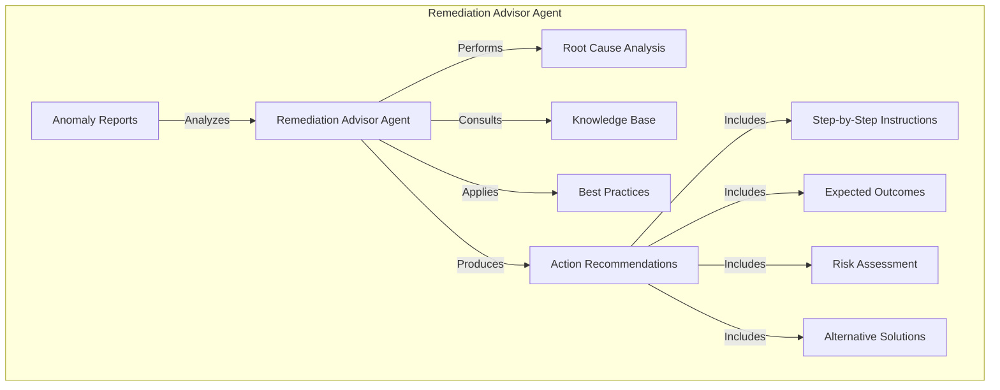

**Remediation Process Flow:**
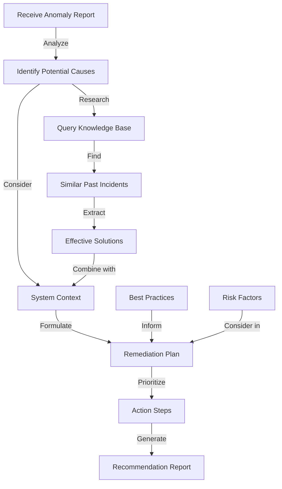

### Agent Communication Patterns
- Sequential processing
- Task delegation
- Context sharing
- Result aggregation

**In Simple Words:**
Agents need to work together like members of a team. They can work in different ways:
1. Sequential processing: Like an assembly line, where each agent does its part and passes the work to the next agent
2. Task delegation: Like a manager assigning tasks to team members based on their skills
3. Context sharing: Like team members sharing important information so everyone has the complete picture
4. Result aggregation: Like combining individual reports into a comprehensive summary

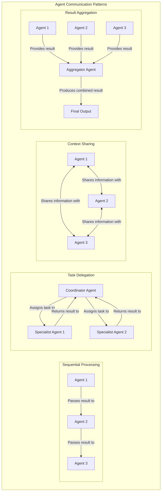

### Multi-Agent System Architecture
```python
def create_agents(self):
    """Create all the required agents for the monitoring system"""
    # Create a query tool for the knowledge base
    kb_tool = self._create_query_engine_tool()
    
    # Create Anomaly Detection Agent
    anomaly_detector = Agent(...)
    
    # Create Root Cause Analysis Agent
    root_cause_analyzer = Agent(...)
    
    # Create Remediation Advisor Agent
    remediation_advisor = Agent(...)
    
    # Create Communicator Agent
    communicator = Agent(...)
    
    return {
        "anomaly_detector": anomaly_detector,
        "root_cause_analyzer": root_cause_analyzer,
        "remediation_advisor": remediation_advisor,
        "communicator": communicator
    }
```

**In Simple Words:**
This code creates a team of specialized AI agents, each with a specific job:
1. The Anomaly Detection Agent spots unusual patterns in your system
2. The Root Cause Analysis Agent figures out why problems are happening
3. The Remediation Advisor Agent recommends how to fix the problems
4. The Communicator Agent explains the findings and recommendations to humans

Each agent has access to a knowledge base tool that helps it find relevant information to do its job better.

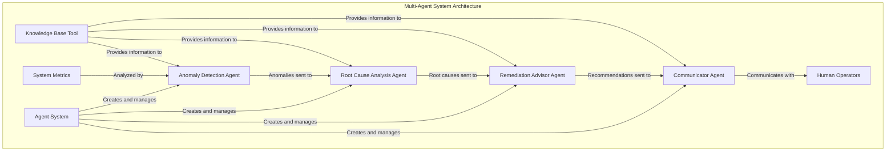

## System Integration (45 min)

### Connecting Components
- API service architecture
- Component communication flow
- Error handling strategies
- Configuration management

**In Simple Words:**
Connecting all the parts of our system is like building a complex machine where each part needs to work with the others. We need to:
1. Create a central service (API) that all parts can talk to
2. Define how information flows between components
3. Plan for what happens when things go wrong
4. Make it easy to adjust settings without changing the code

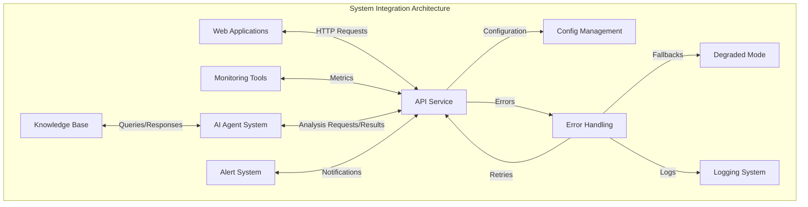

### Data Flow Management
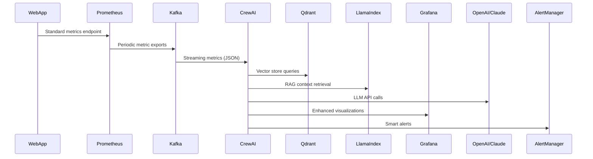

**In Simple Words:**
This diagram shows how data flows through our system:
1. Your application (WebApp) provides measurements through a standard endpoint
2. Prometheus collects these measurements regularly
3. The measurements are sent to Kafka for efficient distribution
4. Our AI agent system (CrewAI) receives and processes these measurements
5. When needed, the AI agents look up information in our knowledge base (Qdrant and LlamaIndex)
6. The AI agents use powerful language models (OpenAI/Claude) to analyze the data
7. Results are sent to visualization tools (Grafana) and alert systems (AlertManager)

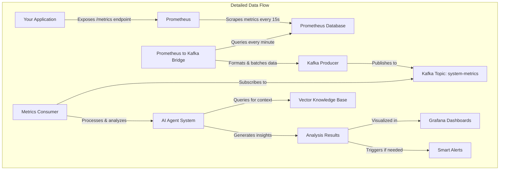

### API Implementation
```python
@app.post("/analyze", response_model=AnomalyResponse)
async def analyze_metrics(request: AnomalyRequest):
    """Analyze metrics for anomalies"""
    try:
        async with httpx.AsyncClient() as client:
            response = await client.post(
                f"{AI_AGENTS_URL}/analyze",
                json=request.dict(),
                timeout=60  # LLM calls might take time
            )
            if response.status_code != 200:
                raise HTTPException(
                    status_code=response.status_code,
                    detail=f"Error from AI agents: {response.text}"
                )
            return response.json()
    except httpx.TimeoutException:
        raise HTTPException(status_code=504, detail="Analysis timed out")
    except Exception as e:
        raise HTTPException(status_code=500, detail=f"Analysis error: {str(e)}")
```

**In Simple Words:**
This code creates an API endpoint that applications can use to request anomaly analysis. It works like this:
1. An application sends metrics data to the `/analyze` endpoint
2. The API forwards this request to our AI agent system
3. It waits for a response (up to 60 seconds, since AI analysis takes time)
4. If everything works, it returns the analysis results
5. If something goes wrong (timeout, error from AI agents, or other issues), it returns an appropriate error message

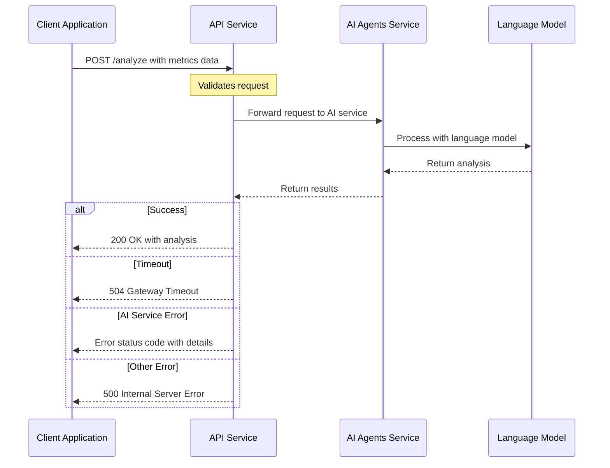

### Error Handling
- Graceful degradation
- Retry mechanisms
- Fallback strategies
- Comprehensive logging

**In Simple Words:**
Good error handling is like having backup plans for when things go wrong:
1. Graceful degradation: If some parts of the system fail, other parts still work (like a car that can still drive even if the radio breaks)
2. Retry mechanisms: Automatically trying again when something fails (like redialing a phone number when you get a busy signal)
3. Fallback strategies: Having alternative ways to get results (like taking a different route when your usual road is closed)
4. Comprehensive logging: Keeping detailed records of what happened (like a ship's log that records everything for later investigation)

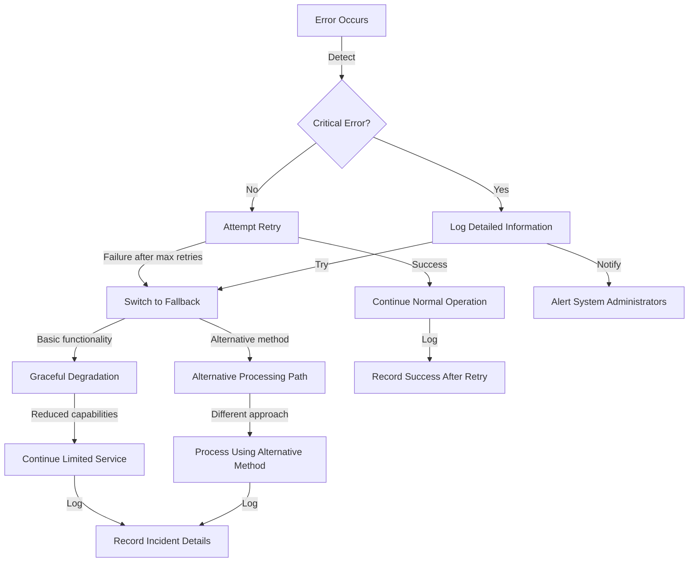

## Hands-on: Implementing Smart Alerts (30 min)

### Creating Custom Metrics
- Defining business-relevant metrics
- Implementing custom collectors
- Exposing metrics through HTTP endpoint
- Registering metrics with Prometheus

**In Simple Words:**
Creating custom metrics is like adding special gauges to your car's dashboard that show information specific to how you drive:
1. First, you decide what's important to measure (like how many customers are using a specific feature)
2. Then, you create a way to collect this information (like counting feature usage)
3. Next, you make this information available for monitoring tools to see (through an HTTP endpoint)
4. Finally, you tell Prometheus where to find these new measurements

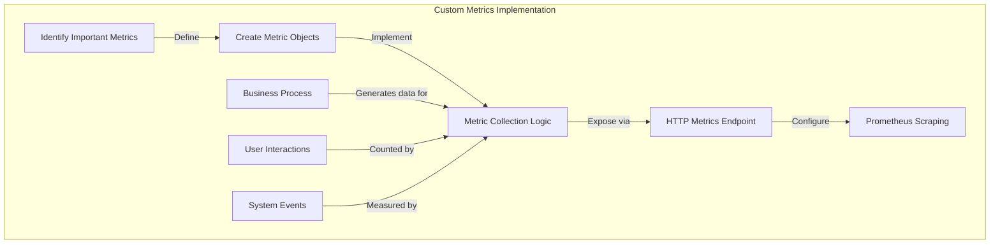

**Example Metric Types:**
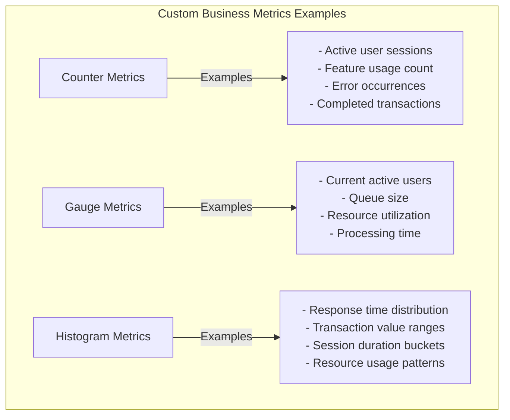

### Building Alert Rules
```yaml
- alert: HighErrorRate
  expr: sum(rate(example_app_errors_total[5m])) / sum(rate(example_app_requests_total[5m])) > 0.05
  for: 1m
  labels:
    severity: critical
  annotations:
    summary: "High error rate detected"
    description: "Error rate is above 5% for the last 5 minutes (current value: {{ $value | humanizePercentage }})"
```

**In Simple Words:**
Alert rules are like setting alarm thresholds for your system. This example creates an alert that triggers when:
1. The error rate (errors divided by total requests) exceeds 5%
2. This high rate continues for at least 1 minute
3. When triggered, it's marked as "critical" severity
4. The alert includes a clear summary and description of the problem

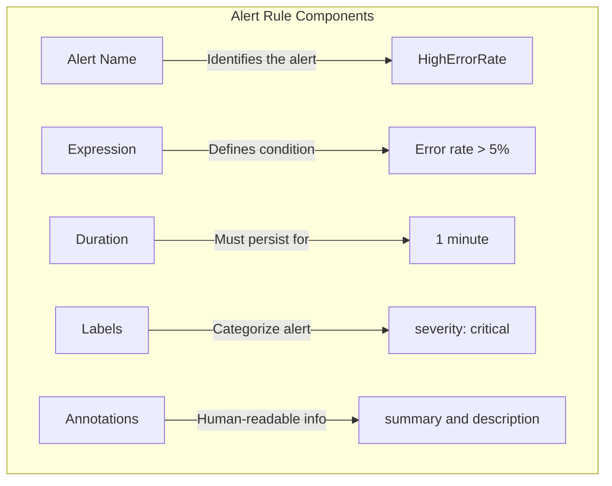

**Alert Rule Evaluation Process:**
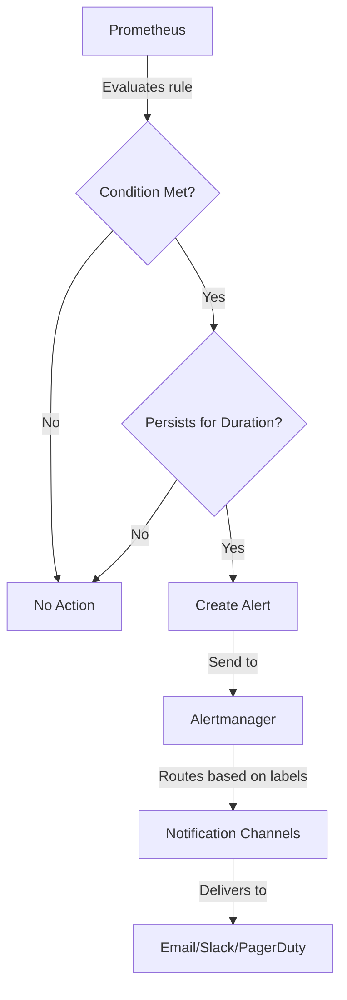

### Agent-Based Response Handling
- Automated analysis of alert triggers
- Context-aware response generation
- Remediation recommendation
- Incident documentation

**In Simple Words:**
Agent-based response handling is like having a smart assistant that helps when alerts go off:
1. When an alert triggers, the assistant automatically investigates what's happening
2. It looks at the context (what's normal, what else is happening, past similar incidents)
3. It suggests specific steps to fix the problem
4. It creates documentation of the incident for future reference

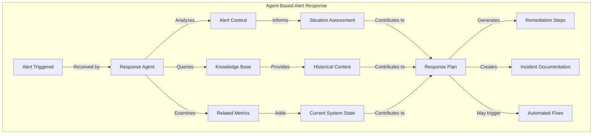

### Exercise: Create a Complete Alert Workflow
- Define custom metrics for a specific scenario
- Create Prometheus alert rules
- Implement agent-based analysis
- Test the end-to-end workflow

**In Simple Words:**
In this exercise, you'll build a complete alert system:
1. Create custom measurements for a specific situation (like monitoring a shopping cart service)
2. Set up rules that trigger alerts when something goes wrong
3. Create an AI agent that analyzes the alert and suggests solutions
4. Test the whole system to make sure it works correctly

```mermaid
flowchart LR
    subgraph "Complete Alert Workflow Exercise"
        A[Your Application] -->|"Exposes"| B[Custom Metrics]
        B -->|"Scraped by"| C[Prometheus]
        C -->|"Evaluates"| D[Alert Rules]
        D -->|"Triggers"| E[Alertmanager]
        E -->|"Notifies"| F[AI Agent System]
        F -->|"Analyzes"| G[Alert Context]
        F -->|"Queries"| H[Knowledge Base]
        F -->|"Generates"| I[Response Plan]
        I -->|"Sent to"| J[Operations Team]
        I -->|"Documented in"| K[Incident System]
    end
