# Session 4: Deployment and Advanced Topics

## Deployment Strategies (45 min)

### Local Development Setup
- Docker Compose configuration
- Environment variables management
- Volume mapping for persistence
- Network configuration

```yaml
services:
  # Infrastructure services
  zookeeper:
    image: bitnami/zookeeper:latest
    ports:
      - "2181:2181"
    environment:
      - ALLOW_ANONYMOUS_LOGIN=yes
    volumes:
      - zookeeper_data:/bitnami/zookeeper
    healthcheck:
      test: ["CMD", "nc", "-z", "localhost", "2181"]
      interval: 10s
      timeout: 5s
      retries: 5

  kafka:
    image: bitnami/kafka:latest
    ports:
      - "9092:9092"
    environment:
      - KAFKA_BROKER_ID=1
      - KAFKA_CFG_LISTENERS=PLAINTEXT://:9092
      - KAFKA_CFG_ADVERTISED_LISTENERS=PLAINTEXT://kafka:9092
      - KAFKA_CFG_ZOOKEEPER_CONNECT=zookeeper:2181
      - ALLOW_PLAINTEXT_LISTENER=yes
    volumes:
      - kafka_data:/bitnami/kafka
    depends_on:
      zookeeper:
        condition: service_healthy
```

**In Simple Words:**
This Docker Compose configuration is like a recipe for setting up your development environment. It tells Docker how to create and connect all the services your system needs. Think of it as building a miniature version of your entire system on your computer:

1. It creates containers (like mini-computers) for each service
2. It sets up the connections between these containers
3. It configures how each service should run
4. It ensures data is saved even when containers are restarted

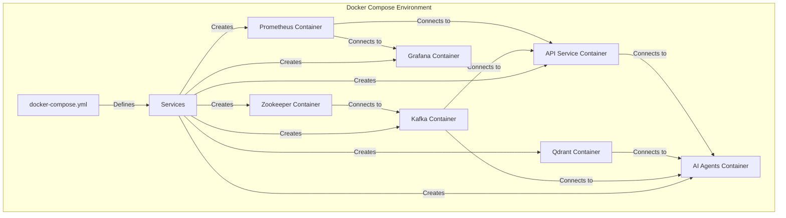

**Docker Compose Components Explained:**
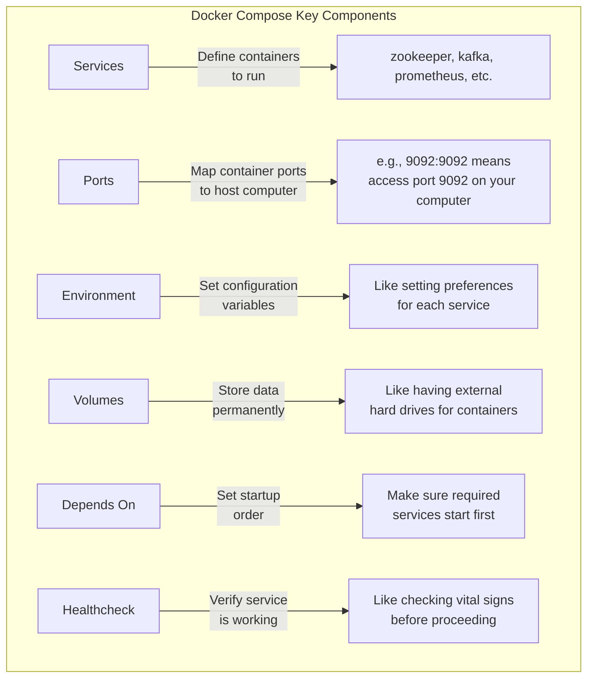

### Docker Containerization
- Dockerfile best practices
- Multi-stage builds
- Image optimization
- Container orchestration

```dockerfile
# Example Dockerfile for AI Agents service
FROM python:3.12-slim

WORKDIR /app

# Install dependencies
COPY ../requirements.txt .
RUN pip install --no-cache-dir -r requirements.txt

# Copy application code
COPY .. .

# Set environment variables
ENV PYTHONUNBUFFERED=1

# Expose port
EXPOSE 8001

# Run the application
CMD ["uvicorn", "main:app", "--host", "0.0.0.0", "--port", "8001"]
```

**In Simple Words:**
A Dockerfile is like a set of instructions for building a specialized container for your application. Think of it as creating a custom appliance that has exactly what your application needs to run:

1. It starts with a base image (like starting with a basic computer)
2. It installs all the required software and libraries
3. It copies your application code into the container
4. It configures how your application should run
5. It specifies which ports should be available for communication

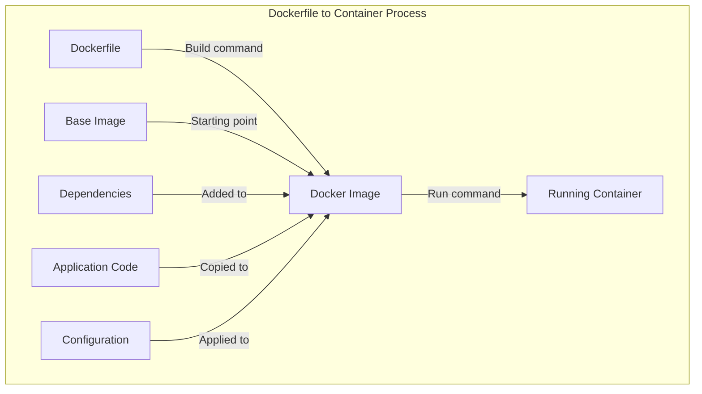

**Multi-stage Build Process:**
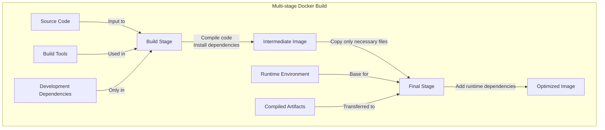

### Heroku Deployment
- Platform setup
- Application configuration
- Environment variables
- Scaling considerations

**In Simple Words:**
Deploying to Heroku is like renting a pre-furnished apartment instead of building your own house. Heroku provides a platform where you can easily deploy your application without worrying about the underlying infrastructure:

1. You set up an account and create a new application
2. You configure your application settings and environment variables
3. You push your code to Heroku's servers
4. Heroku automatically builds and runs your application

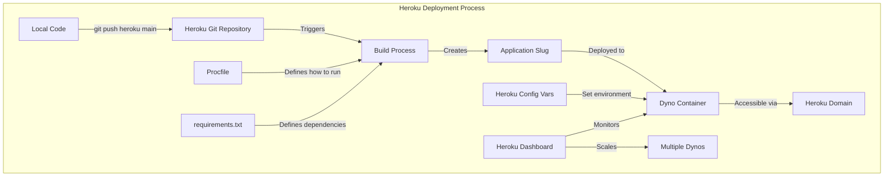

**Deployment Options Comparison:**
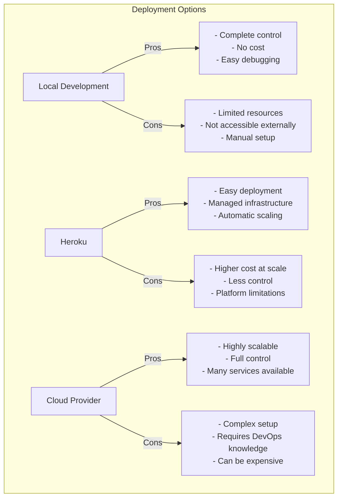

### CI/CD Pipeline
- Automated testing
- Continuous integration
- Deployment automation
- Monitoring and rollback

**In Simple Words:**
A CI/CD pipeline is like an automated assembly line for your software. Instead of manually building, testing, and deploying your application, the pipeline does it all automatically whenever you make changes:

1. When you push code changes, the pipeline automatically starts
2. It builds your application and runs all the tests
3. If the tests pass, it automatically deploys the new version
4. It monitors the deployment and can roll back if problems occur

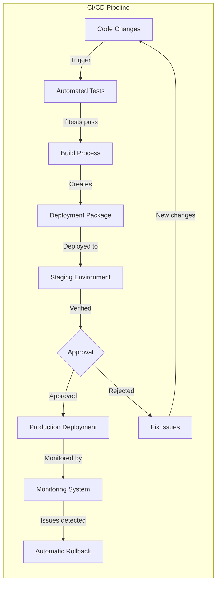

## Advanced Features and Best Practices (45 min)

### Scaling Considerations
- Horizontal vs. vertical scaling
- Stateless service design
- Load balancing strategies
- Database scaling

**In Simple Words:**
Scaling your system is like handling a growing number of customers in a restaurant:

1. Vertical scaling is like getting a bigger restaurant with more kitchen space (adding more power to existing servers)
2. Horizontal scaling is like opening multiple restaurant locations (adding more servers)
3. Stateless service design is like having standardized recipes that any chef can make (services that don't depend on stored information)
4. Load balancing is like having a host who directs customers to different tables or locations (distributing traffic across servers)

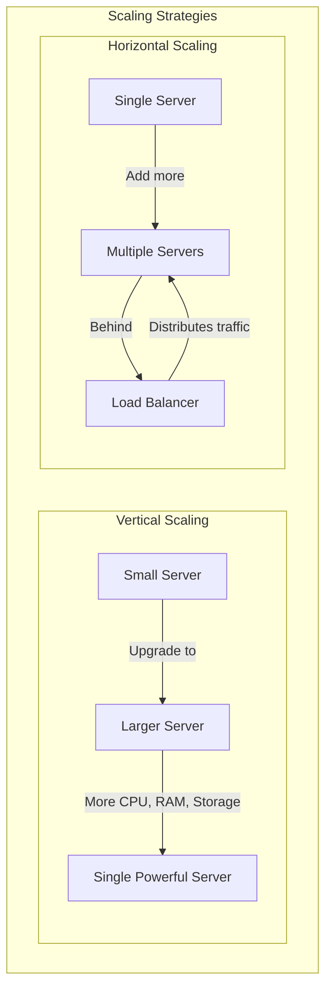

**Scaling Components:**
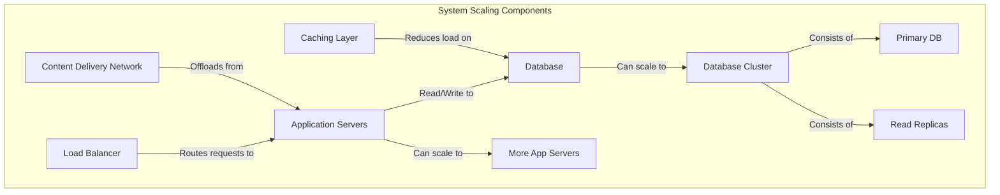

### Security Best Practices
- API authentication and authorization
- Secrets management
- Network security
- Data encryption

**In Simple Words:**
Security for your system is like protecting your home:

1. API authentication is like checking ID at the door (verifying who is making requests)
2. Authorization is like having different keys for different rooms (controlling what users can access)
3. Secrets management is like keeping your valuables in a safe (protecting sensitive information)
4. Network security is like having a fence and alarm system (protecting the perimeter)
5. Data encryption is like using a secret code for messages (protecting information from unauthorized access)

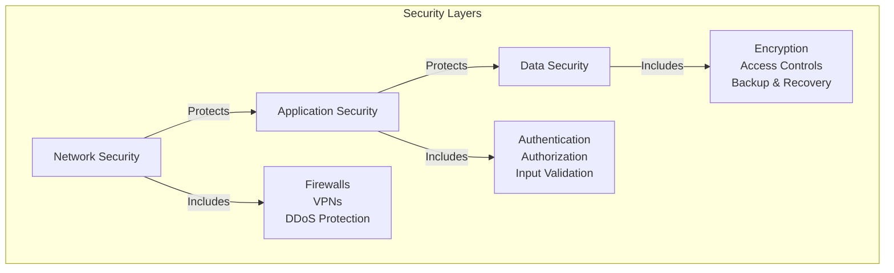

**Authentication Flow:**
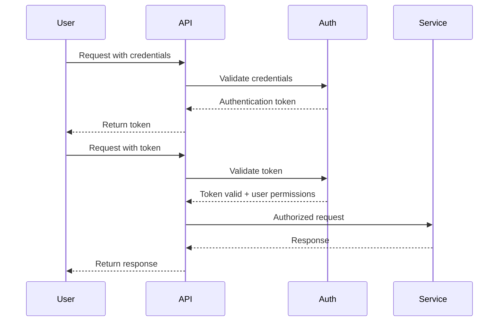

### Performance Optimization
- Caching strategies
- Database query optimization
- Asynchronous processing
- Resource utilization monitoring

**In Simple Words:**
Performance optimization is like making your car run faster and more efficiently:

1. Caching is like keeping frequently used items on your desk instead of going to the filing cabinet (storing frequently accessed data in memory)
2. Database query optimization is like finding the shortest route to your destination (making database operations more efficient)
3. Asynchronous processing is like multitasking instead of doing one thing at a time (handling operations in parallel)
4. Resource monitoring is like watching your car's dashboard to see how it's performing (tracking system performance)

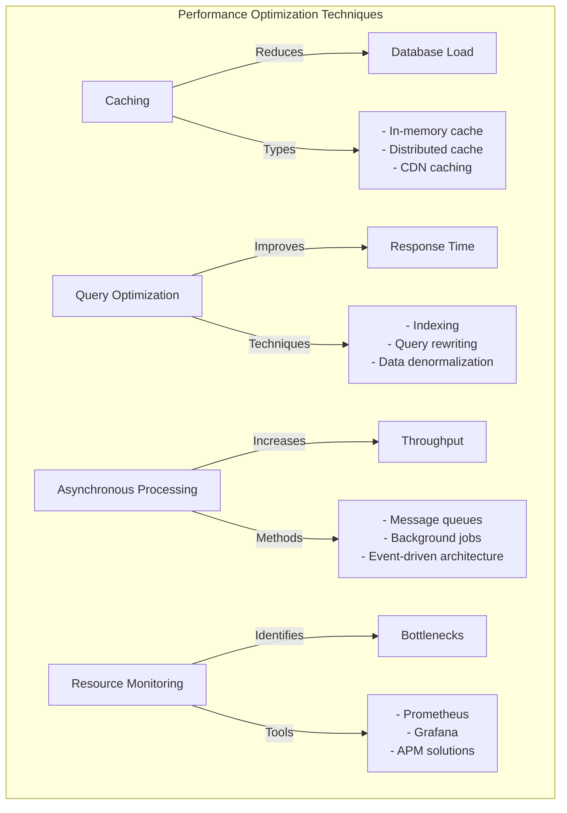

### Advanced Agent Capabilities
- Tool integration for agents
- Custom reasoning strategies
- Specialized agent roles
- Advanced coordination patterns

```python
# Example of a specialized agent with custom tools
from llama_index.core.tools import QueryEngineTool, ToolMetadata
from crewai import Agent

# Create a specialized tool for the agent
performance_tool = QueryEngineTool(
    query_engine=performance_index.as_query_engine(),
    metadata=ToolMetadata(
        name="performance_knowledge",
        description="Use this tool to access specialized knowledge about system performance optimization."
    )
)

# Create an agent with the specialized tool
performance_expert = Agent(
    role="Performance Optimization Specialist",
    goal="Identify performance bottlenecks and recommend optimizations",
    backstory="You're an expert in system performance with years of experience optimizing high-scale applications.",
    verbose=True,
    allow_delegation=True,
    tools=[performance_tool, kb_tool]
)
```

**In Simple Words:**
Advanced agent capabilities are like upgrading your team members with special skills and tools:

1. Tool integration is like giving your team specialized equipment (providing agents with specific capabilities)
2. Custom reasoning strategies are like teaching team members different problem-solving approaches
3. Specialized agent roles are like having experts in specific areas (creating agents focused on particular tasks)
4. Advanced coordination patterns are like improving how your team works together (enhancing agent collaboration)

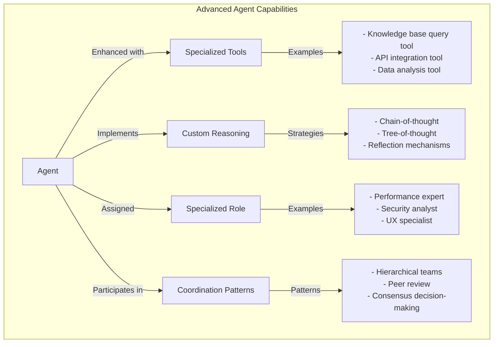

**Agent Tool Integration:**
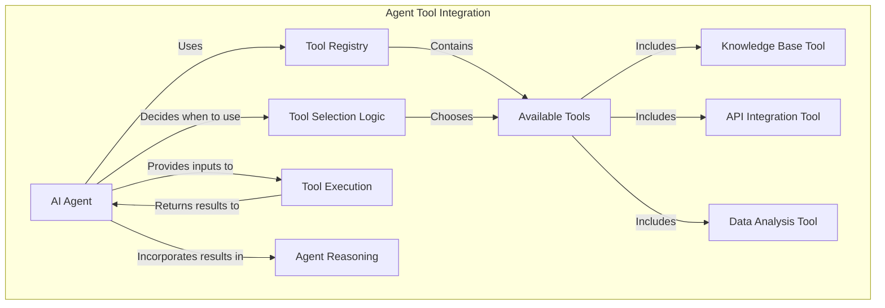

## Final Project Work (30 min)

### Completing the Monitoring System
- Integrating all components
- Configuration finalization
- Documentation
- Testing strategy

**In Simple Words:**
Completing the monitoring system is like finishing the construction of a building:

1. Integrating all components is like connecting the plumbing, electrical, and HVAC systems
2. Configuration finalization is like setting all the switches and controls to their proper settings
3. Documentation is like creating user manuals and maintenance guides
4. Testing strategy is like inspecting the building to make sure everything works correctly

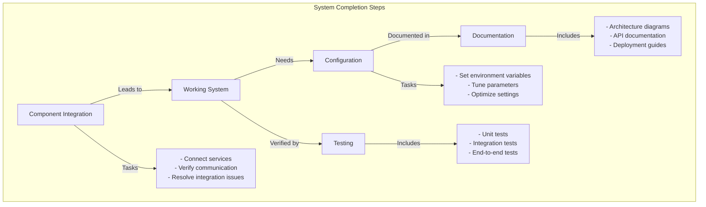

### Testing End-to-End Functionality
- Component testing
- Integration testing
- Performance testing
- Chaos testing

**In Simple Words:**
Testing your system is like making sure a car is safe and reliable before driving it:

1. Component testing is like checking each part individually (testing individual services)
2. Integration testing is like making sure the engine connects properly to the transmission (testing how services work together)
3. Performance testing is like seeing how fast the car can go and how it handles (testing system speed and capacity)
4. Chaos testing is like seeing how the car handles in extreme conditions (testing system resilience when things go wrong)

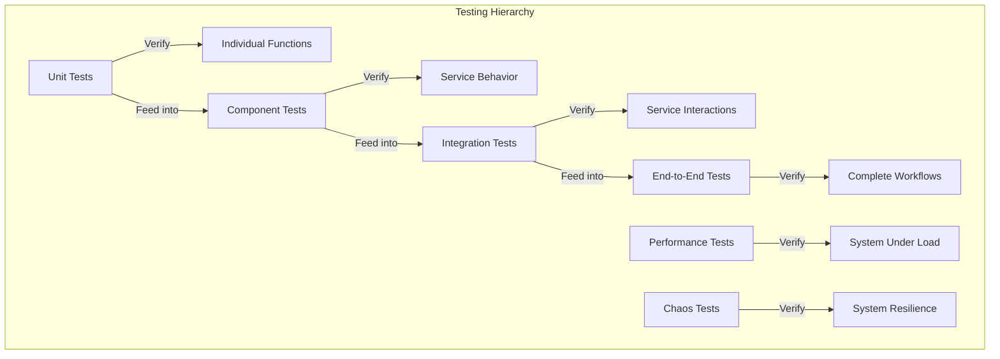

### Deployment Verification
- Health checks
- Metrics validation
- Alert testing
- Failover testing

**In Simple Words:**
Deployment verification is like doing a final check of your car before a long road trip:

1. Health checks are like making sure the engine starts and runs smoothly
2. Metrics validation is like checking that the dashboard gauges are working correctly
3. Alert testing is like making sure the warning lights come on when they should
4. Failover testing is like practicing what to do if you get a flat tire

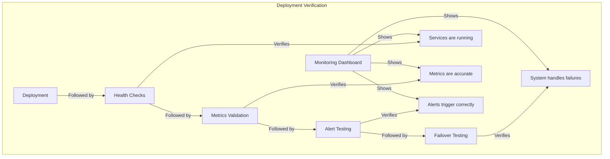

### Project Showcase
- System demonstration
- Key features highlight
- Performance metrics
- Future enhancements

**In Simple Words:**
A project showcase is like presenting your new car to friends and family:

1. System demonstration is like showing how the car drives
2. Key features highlight is like pointing out the special features like GPS or heated seats
3. Performance metrics is like sharing the fuel efficiency and acceleration numbers
4. Future enhancements is like talking about the upgrades you're planning to add later

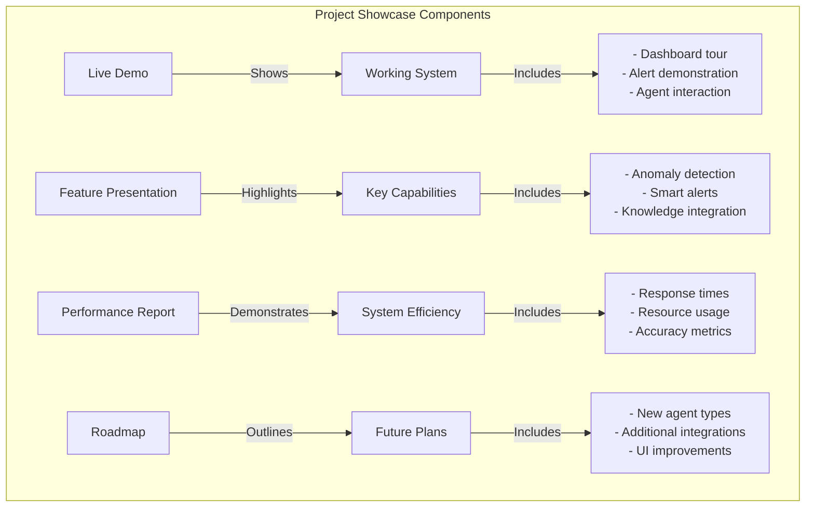

## Course Wrap-up

### Learning Milestones Review
1. Create and deploy a basic AI agent ✓
2. Implement a working monitoring pipeline ✓
3. Build a functional knowledge base ✓
4. Deploy a complete distributed system ✓

**In Simple Words:**
The learning milestones review is like checking off items on your vacation packing list to make sure you've got everything:

1. We've created AI agents that can analyze system data
2. We've built a pipeline that collects and processes monitoring information
3. We've created a knowledge base that helps our agents make smart decisions
4. We've learned how to deploy all these components as a complete system

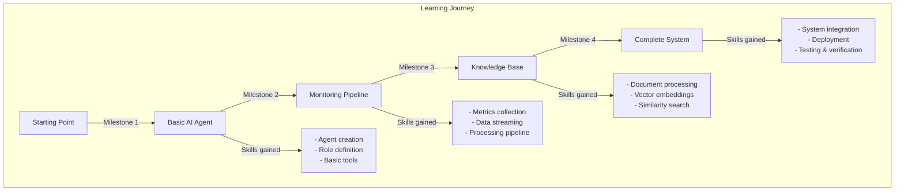

### Next Steps
- Advanced CrewAI features
- Custom LLM fine-tuning
- Integration with additional data sources
- Production deployment considerations

**In Simple Words:**
Next steps are like planning your next adventure after completing this one:

1. Advanced CrewAI features are like learning advanced driving techniques
2. Custom LLM fine-tuning is like customizing your car's engine for specific performance needs
3. Integration with additional data sources is like adding new sensors and cameras to your car
4. Production deployment considerations are like preparing your car for daily commuting instead of just weekend drives

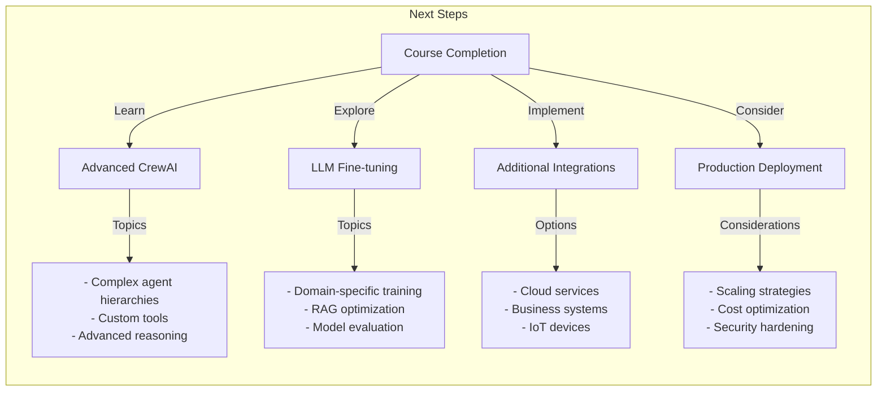

### Resources for Further Learning
- CrewAI documentation
- LlamaIndex tutorials
- Prometheus and Grafana workshops
- Vector database deep dives

**In Simple Words:**
Resources for further learning are like maps and guidebooks for your continued journey:

1. CrewAI documentation is like the detailed owner's manual for your car
2. LlamaIndex tutorials are like driving lessons for specific techniques
3. Prometheus and Grafana workshops are like mechanic's courses on maintaining your car
4. Vector database deep dives are like specialized training on how the engine works

```mermaid
graph TD
    subgraph "Learning Resources"
        A[Official Documentation] -->|"Includes"| A1["- CrewAI docs<br>- LlamaIndex docs<br>- Prometheus docs"]
        
        B[Tutorials & Workshops] -->|"Includes"| B1["- Video tutorials<br>- Hands-on workshops<br>- Code examples"]
        
        C[Community Resources] -->|"Includes"| C1["- GitHub repositories<br>- Discussion forums<br>- Blog posts"]
        
        D[Advanced Courses] -->|"Includes"| D1["- LLM specialization<br>- Vector DB deep dives<br>- Monitoring masterclass"]
    end
```

### Q&A and Discussion
