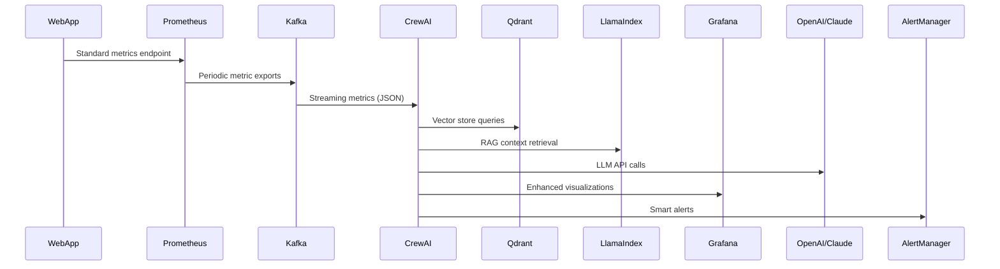

# AI-Enhanced Web Service Monitoring System

## System Architecture Overview

The AI-Enhanced Web Service Monitoring System combines traditional metrics-based monitoring with AI-powered analysis to provide deeper insights into system behavior and anomalies. The system uses a multi-agent approach to analyze metrics, detect anomalies, determine root causes, and recommend remediation actions.

### Key Components

```
Web Apps → Prometheus → Kafka → CrewAI+LLM → Grafana + AlertManager
                                    ↑
                                    │
                                Qdrant + LlamaIndex
```

#### Data Flow



## Component Details

### 1. Prometheus Exporter

The `AIPrometheusExporter` class provides a framework-agnostic way to instrument web applications and expose metrics to Prometheus.

```python
class AIPrometheusExporter:
    def __init__(self, app_name: str = "web_app", registry: Optional[CollectorRegistry] = None):
        self.app_name = app_name
        self.registry = registry or CollectorRegistry()
        
        # Initialize metrics
        self._setup_metrics()
        
        # Thread-local storage for request timing
        self.local = threading.local()
    
    def _setup_metrics(self):
        """Set up the default metrics"""
        # Request count and latency
        self.request_counter = Counter(
            f"{self.app_name}_requests_total",
            "Total number of HTTP requests",
            ["method", "endpoint", "status"],
            registry=self.registry
        )
        
        self.request_latency = Histogram(
            f"{self.app_name}_request_duration_seconds",
            "HTTP request latency in seconds",
            ["method", "endpoint"],
            registry=self.registry
        )
        
        # Error count
        self.error_counter = Counter(
            f"{self.app_name}_errors_total",
            "Total number of errors",
            ["method", "endpoint", "error_type"],
            registry=self.registry
        )
        
        # Active requests gauge
        self.active_requests = Gauge(
            f"{self.app_name}_active_requests",
            "Number of active HTTP requests",
            ["method"],
            registry=self.registry
        )
```

### 2. Prometheus to Kafka Bridge

The `PrometheusToKafkaBridge` class connects Prometheus to Kafka, streaming metrics for real-time processing.

```python
class PrometheusToKafkaBridge:
    def __init__(self, prometheus_url, kafka_brokers, topic="prom_metrics",
                 polling_interval=60, batch_size=100):
        self.prometheus_url = prometheus_url
        self.kafka_brokers = kafka_brokers
        self.topic = topic
        self.polling_interval = polling_interval
        self.batch_size = batch_size
        self.prom = None
        self.producer = None
    
    @backoff.on_exception(backoff.expo, Exception, max_tries=5)
    def query_prometheus(self, query='{__name__!=""}'):
        """Query Prometheus with exponential backoff retry"""
        return self.prom.custom_query(query)
    
    def run(self):
        """Main loop to poll Prometheus and send metrics to Kafka"""
        if not self.connect():
            logging.error("Failed to connect. Exiting.")
            return False
        
        logging.info("Starting Prometheus to Kafka bridge")
        while True:
            try:
                metrics = self.query_prometheus()
                
                # Split metrics into batches to avoid large messages
                for i in range(0, len(metrics), self.batch_size):
                    batch = metrics[i:i+self.batch_size]
                    self.producer.send(self.topic, batch)
                
                # Sleep until next polling interval
                time.sleep(self.polling_interval)
                
            except KeyboardInterrupt:
                logging.info("Received shutdown signal")
                self.producer.flush()
                self.producer.close()
                break
            except Exception as e:
                logging.error(f"Unexpected error: {str(e)}")
```

### 3. LlamaIndex with Qdrant Integration

The `QdrantKnowledgeBase` class provides vector storage and retrieval for the knowledge base.

```python
class QdrantKnowledgeBase:
    def __init__(self, 
                 collection_name="monitoring_knowledge",
                 qdrant_url="http://qdrant:6333",
                 qdrant_api_key=None,
                 embedding_dim=1536,  # Default for OpenAI's ada-002
                 knowledge_dir="./knowledge"):
        self.collection_name = collection_name
        self.qdrant_url = qdrant_url
        self.qdrant_api_key = qdrant_api_key
        self.embedding_dim = embedding_dim
        self.knowledge_dir = knowledge_dir
        self.client = None
        self.index = None
        
        # Set up Qdrant client
        self._setup_qdrant_client()
    
    def build_index(self, force_rebuild=False):
        """Build or load the vector index"""
        try:
            # Get count of vectors in collection
            collection_info = self.client.get_collection(self.collection_name)
            vector_count = collection_info.vectors_count
            
            # If collection is empty or force_rebuild is True, build the index
            if vector_count == 0 or force_rebuild:
                # Load documents
                documents = SimpleDirectoryReader(self.knowledge_dir).load_data()
                
                # Create Qdrant vector store
                vector_store = QdrantVectorStore(
                    client=self.client, 
                    collection_name=self.collection_name
                )
                
                # Create storage context
                storage_context = StorageContext.from_defaults(vector_store=vector_store)
                
                # Build index
                self.index = VectorStoreIndex.from_documents(
                    documents,
                    storage_context=storage_context
                )
            else:
                # Create Qdrant vector store
                vector_store = QdrantVectorStore(
                    client=self.client, 
                    collection_name=self.collection_name
                )
                
                # Create storage context
                storage_context = StorageContext.from_defaults(vector_store=vector_store)
                
                # Load index
                self.index = VectorStoreIndex.from_vector_store(
                    vector_store=vector_store,
                    storage_context=storage_context
                )
                
            return self.index
        except Exception as e:
            print(f"Error building/loading index: {str(e)}")
            return None
    
    def query(self, query_text, top_k=5):
        """Query the knowledge base"""
        if not self.index:
            self.build_index()
            
        if not self.index:
            return "Error: Index not available"
            
        try:
            query_engine = self.index.as_query_engine(similarity_top_k=top_k)
            response = query_engine.query(query_text)
            return response
        except Exception as e:
            print(f"Error querying index: {str(e)}")
            return f"Error querying knowledge base: {str(e)}"
```

### 4. CrewAI Multi-Agent System

The `MonitoringAgentSystem` class implements a team of specialized agents for different monitoring tasks.

```python
class MonitoringAgentSystem:
    def __init__(self, 
                 openai_api_key: str = None, 
                 anthropic_api_key: str = None,
                 knowledge_base_path: str = "./knowledge",
                 knowledge_refresh_interval: int = 3600,
                 qdrant_url: str = "http://qdrant:6333",
                 qdrant_api_key: str = None,
                 collection_name: str = "monitoring_knowledge"):
        # Set API keys
        if openai_api_key:
            os.environ["OPENAI_API_KEY"] = openai_api_key
        if anthropic_api_key:
            os.environ["ANTHROPIC_API_KEY"] = anthropic_api_key
            
        self.knowledge_base_path = knowledge_base_path
        self.knowledge_refresh_interval = knowledge_refresh_interval
        self.last_refresh_time = 0
        self.query_engine = None
        
        # Initialize Qdrant knowledge base
        self.knowledge_base = QdrantKnowledgeBase(
            collection_name=collection_name,
            qdrant_url=qdrant_url,
            qdrant_api_key=qdrant_api_key,
            knowledge_dir=knowledge_base_path
        )
        
        # Set up knowledge base
        self._setup_knowledge_base()
        
    def create_agents(self):
        """Create all the required agents for the monitoring system"""
        # Make sure knowledge base is set up
        self._setup_knowledge_base()
        
        # Create a query tool for the knowledge base
        kb_tool = self._create_query_engine_tool()
        
        # Create Anomaly Detection Agent
        anomaly_detector = Agent(
            role="Anomaly Detection Specialist",
            goal="Identify anomalies in system metrics and determine their severity and impact",
            backstory="You're an expert at analyzing system metrics and detecting unusual patterns that indicate potential issues before they become critical failures.",
            verbose=True,
            allow_delegation=True,
            tools=[kb_tool]
        )
        
        # Create Root Cause Analysis Agent
        root_cause_analyzer = Agent(
            role="Root Cause Analyst",
            goal="Determine the underlying cause of detected anomalies",
            backstory="You're a specialized diagnostician who can trace system issues back to their source by analyzing patterns and correlations across multiple metrics and logs.",
            verbose=True,
            allow_delegation=True,
            tools=[kb_tool]
        )
        
        # Create Remediation Advisor Agent
        remediation_advisor = Agent(
            role="Remediation Advisor",
            goal="Provide actionable recommendations to address detected issues",
            backstory="You're a seasoned operations expert who knows the best practices for addressing system issues while minimizing impact on users and maintaining system stability.",
            verbose=True,
            allow_delegation=True,
            tools=[kb_tool]
        )
        
        # Create Communicator Agent
        communicator = Agent(
            role="Technical Communicator",
            goal="Synthesize findings and recommendations into clear, concise reports",
            backstory="You're skilled at translating complex technical information into clear, actionable insights that both technical and non-technical stakeholders can understand.",
            verbose=True,
            allow_delegation=False,
            tools=[kb_tool]
        )
        
        return {
            "anomaly_detector": anomaly_detector,
            "root_cause_analyzer": root_cause_analyzer,
            "remediation_advisor": remediation_advisor,
            "communicator": communicator
        }
    
    def analyze_metrics(self, metrics_data: List[Dict[str, Any]]):
        """Analyze metrics and return insights"""
        # Create agents
        agents = self.create_agents()
        
        # Format metrics for human-readable input
        metrics_str = json.dumps(metrics_data, indent=2)
        
        # Define tasks
        detect_task = Task(
            description=f"Analyze the following metrics and identify any anomalies or unusual patterns. Focus on values that deviate significantly from expected ranges or show concerning trends.\n\nMETRICS DATA:\n{metrics_str}",
            agent=agents["anomaly_detector"],
            expected_output="A detailed description of any anomalies found, including the specific metrics affected, the nature of the anomaly, and the potential severity."
        )
        
        analyze_task = Task(
            description="Based on the anomalies identified, determine the most likely root causes. Consider common failure patterns, system dependencies, and any relevant historical incidents from the knowledge base.",
            agent=agents["root_cause_analyzer"],
            expected_output="A ranked list of potential root causes for the observed anomalies, with supporting evidence and confidence levels for each hypothesis.",
            context=[detect_task]
        )
        
        remediate_task = Task(
            description="Develop a detailed remediation plan for the identified issues. Include immediate mitigation steps as well as longer-term solutions to prevent recurrence.",
            agent=agents["remediation_advisor"],
            expected_output="A step-by-step remediation plan with both immediate actions and strategic recommendations to address the root causes.",
            context=[detect_task, analyze_task]
        )
        
        report_task = Task(
            description="Create a comprehensive incident report that summarizes the anomalies detected, their root causes, and the recommended remediation steps. The report should be concise but thorough, suitable for both technical and management audiences.",
            agent=agents["communicator"],
            expected_output="A well-structured incident report with executive summary, technical details, and actionable recommendations.",
            context=[detect_task, analyze_task, remediate_task]
        )
        
        # Create crew
        crew = Crew(
            agents=list(agents.values()),
            tasks=[detect_task, analyze_task, remediate_task, report_task],
            verbose=2,
            process=Process.sequential
        )
        
        # Execute tasks
        result = crew.kickoff()
        
        return {
            "report": result,
            "timestamp": datetime.now().isoformat()
        }
```

### 5. API Service

The API service exposes endpoints for monitoring and analysis.

```python
@app.post("/analyze", response_model=AnomalyResponse)
async def analyze_metrics(request: AnomalyRequest):
    """Analyze metrics using the AI agent system"""
    try:
        result = agent_system.analyze_metrics(request.metrics)
        
        # Extract recommendations and severity from the report if possible
        recommendations = []
        severity = None
        
        # This is a simple extraction, in a real system you might use more sophisticated parsing
        report_lines = result["report"].split("\n")
        for line in report_lines:
            if line.startswith("- ") and ("recommend" in line.lower() or "suggest" in line.lower()):
                recommendations.append(line[2:])
            elif "severity:" in line.lower():
                severity = line.split(":", 1)[1].strip()
        
        return {
            "report": result["report"],
            "timestamp": result["timestamp"],
            "recommendations": recommendations,
            "severity": severity
        }
    except Exception as e:
        raise HTTPException(status_code=500, detail=f"Analysis error: {str(e)}")

@app.post("/query", response_model=QueryResponse)
async def query_knowledge_base(request: QueryRequest):
    """Query the knowledge base"""
    try:
        response = agent_system.knowledge_base.query(request.query, top_k=request.top_k)
        
        # Extract source documents if available
        source_documents = []
        if hasattr(response, "source_nodes"):
            for node in response.source_nodes:
                source_documents.append({
                    "text": node.node.text,
                    "score": node.score,
                    "metadata": node.node.metadata
                })
        
        return {
            "response": str(response),
            "source_documents": source_documents
        }
    except Exception as e:
        raise HTTPException(status_code=500, detail=f"Query error: {str(e)}")
```

## Framework Integration Examples

### Django Integration

```python
from ai_monitoring import AIPrometheusExporter

class AIMonitoringMiddleware(AIPrometheusExporter):
    def process_request(self, request):
        self.start_request_timer(request)
        
    def process_response(self, request, response):
        self.end_request_timer(request, response)
        return response

# In settings.py
MIDDLEWARE = [
    # ...
    'myapp.middleware.AIMonitoringMiddleware',
]
```

### Flask Integration

```python
from ai_monitoring import AIPrometheusExporter

class FlaskMonitoring(AIPrometheusExporter):
    def __init__(self, app=None):
        super().__init__()
        if app:
            self.init_app(app)
    
    def init_app(self, app):
        @app.before_request
        def start_timer():
            self.start_request_timer(request)
            
        @app.after_request
        def end_timer(response):
            self.end_request_timer(request, response)
            return response
```

### FastAPI Integration

```python
from fastapi import FastAPI, Request, Response
from fastapi.middleware.base import BaseHTTPMiddleware
from ai_monitoring import AIPrometheusExporter

class AIMonitoringMiddleware(BaseHTTPMiddleware, AIPrometheusExporter):
    async def dispatch(self, request: Request, call_next):
        self.start_request_timer(request)
        response = await call_next(request)
        self.end_request_timer(request, response)
        return response

app = FastAPI()
app.add_middleware(AIMonitoringMiddleware)
```

## Alert Rules Examples

```yaml
- alert: HighErrorRate
  expr: sum(rate(example_app_errors_total[5m])) / sum(rate(example_app_requests_total[5m])) > 0.05
  for: 1m
  labels:
    severity: critical
  annotations:
    summary: "High error rate detected"
    description: "Error rate is above 5% for the last 5 minutes (current value: {{ $value | humanizePercentage }})"

- alert: HighLatency
  expr: histogram_quantile(0.95, sum(rate(example_app_request_duration_seconds_bucket[5m])) by (le, endpoint)) > 1
  for: 5m
  labels:
    severity: warning
  annotations:
    summary: "High latency detected"
    description: "95th percentile latency is above 1s for endpoint {{ $labels.endpoint }} (current value: {{ $value }}s)"

- alert: HighActiveRequests
  expr: sum(example_app_active_requests) > 100
  for: 2m
  labels:
    severity: warning
  annotations:
    summary: "High number of active requests"
    description: "Number of active requests is above 100 (current value: {{ $value }})"
```

## Deployment Configuration

### Docker Compose

```yaml
services:
  # Infrastructure services
  zookeeper:
    image: bitnami/zookeeper:latest
    ports:
      - "2181:2181"
    environment:
      - ALLOW_ANONYMOUS_LOGIN=yes
    volumes:
      - zookeeper_data:/bitnami/zookeeper
    healthcheck:
      test: ["CMD", "nc", "-z", "localhost", "2181"]
      interval: 10s
      timeout: 5s
      retries: 5

  kafka:
    image: bitnami/kafka:latest
    ports:
      - "9092:9092"
    environment:
      - KAFKA_BROKER_ID=1
      - KAFKA_CFG_LISTENERS=PLAINTEXT://:9092
      - KAFKA_CFG_ADVERTISED_LISTENERS=PLAINTEXT://kafka:9092
      - KAFKA_CFG_ZOOKEEPER_CONNECT=zookeeper:2181
      - ALLOW_PLAINTEXT_LISTENER=yes
    volumes:
      - kafka_data:/bitnami/kafka
    depends_on:
      zookeeper:
        condition: service_healthy
      
  prometheus:
    image: prom/prometheus:latest
    container_name: prometheus
    restart: unless-stopped
    ports:
      - '9090:9090'
    volumes:
      - prometheus_data:/prometheus


  grafana:
    image: grafana/grafana-enterprise
    container_name: grafana
    restart: unless-stopped
    ports:
      - '3000:3000'
    volumes:
      - grafana_data:/var/lib/grafana
    environment:
      - GF_SECURITY_ADMIN_PASSWORD=admin
      - GF_SECURITY_ADMIN_USER=admin
      - GF_USERS_ALLOW_SIGN_UP=false
    depends_on:
      - prometheus
  
  qdrant:
    image: qdrant/qdrant:latest
    ports:
      - "6333:6333"
      - "6334:6334"
    volumes:
      - qdrant_data:/qdrant/storage
    healthcheck:
      test: ["CMD", "curl", "-f", "http://localhost:6333/readiness"]
      interval: 10s
      timeout: 5s
      retries: 5

volumes:
  prometheus_data:
  grafana_data:
  qdrant_data:
  zookeeper_data:
  kafka_data:
```

## Knowledge Base Structure

```
knowledge/
├── logs/                     # Application logs
│   └── example_logs.txt
├── best_practices/           # Best practices documentation
│   ├── performance_tuning.md
│   └── troubleshooting.md
└── incidents/                # Incident reports
    ├── incident_2023_01_15.md
    └── postmortem_template.md
```

## Project Directory Structure

```
ai-monitoring/
├── .env                           # Environment variables
├── docker-compose.yml            # Docker Compose configuration
├── README.md                     # Project documentation
│
├── app/                          # Main application code
│   ├── __init__.py
│   ├── prom_exporter.py          # Prometheus metrics exporter
│   ├── prometheus_to_kafka.py    # Prometheus to Kafka bridge
│   ├── api/                      # FastAPI application
│   │   ├── __init__.py
│   │   ├── main.py               # API routes
│   │   ├── models.py             # Data models
│   │   └── utils.py              # Utility functions
│   │
│   ├── web_app.py                # Example web application
│   └── Dockerfile.api            # Dockerfile for API service
│
├── ai-agents/                    # AI agent code
│   ├── __init__.py
│   ├── agent_system.py           # MonitoringAgentSystem implementation
│   ├── agents/                   # Individual agent implementations
│   │   ├── __init__.py
│   │   ├── anomaly_detector.py   # Anomaly detection agent
│   │   ├── root_cause_analyzer.py # Root cause analysis agent
│   │   ├── remediation_advisor.py # Remediation advisor agent
│   │   └── communicator.py       # Report generation agent
│   │
│   ├── llamaindex_qdrant.py      # Qdrant knowledge base integration
│   ├── main.py                   # Agent service entry point
│   └── Dockerfile                # Dockerfile for agent service
│
├── knowledge/                    # Knowledge base sources
│   ├── logs/                     # Application logs
│   │   └── example_logs.txt
│   ├── best_practices/           # Best practices documentation
│   │   ├── performance_tuning.md
│   │   └── troubleshooting.md
│   └── incidents/                # Incident reports
│       ├── incident_2023_01_15.md
│       └── postmortem_template.md
│
├── prometheus/                   # Prometheus configuration
│   ├── prometheus.yml            # Main configuration
│   └── alerts.yml                # Alert rules
│
└── grafana/                      # Grafana configuration
    └── provisioning/             # Provisioning configuration
        ├── dashboards/           # Dashboard definitions
        │   ├── ai_monitoring.json
        │   └── system_overview.json
        └── datasources/          # Data source configuration
            └── prometheus.yml
